# Personal Podcast Generator

A user sets their interests; on a schedule (or on demand) the backend finds news with
[Exa](https://exa.ai), writes a grounded two-host script with OpenAI, voices it with
ElevenLabs, and publishes an MP3. An admin dashboard shows usage and pipeline metrics.

Backend: FastAPI, Python 3.12, PostgreSQL. Frontend: Vite + React + TypeScript.
See `solution.md` for the decisions, trade-offs and next steps, `docs/ARCHITECTURE.md` for the full design (with diagrams) and `docs/DECISIONS.md` for the decision log.

## Quickstart (Docker)

The whole app (Postgres, the API with its scheduler and pipeline, and the web app) runs in Docker.
You need only **Git** and **Docker**; Python, Node and ffmpeg live inside the images.

<details>
<summary>Install Git and Docker</summary>

Windows (PowerShell):

```powershell
winget install Git.Git Docker.DockerDesktop
```

Then start Docker Desktop. The first install may ask for a restart to enable WSL2.

macOS: `brew install git` and [Docker Desktop](https://docs.docker.com/desktop/). Linux: Git from your
package manager and [Docker Engine + the Compose plugin](https://docs.docker.com/engine/install/).
</details>

1. **Clone the repo**

   ```bash
   git clone https://github.com/mpenalverguilera/podcast-generator.git
   cd podcast-generator
   ```

2. **Start it.** No API keys? Run it on the fake adapters. Every page works, episodes are generated
   (canned articles and script, silent audio), and the dashboard fills in:

   ```bash
   docker compose -f docker-compose.yml -f docker-compose.fake.yml up --build
   ```

   With real providers, create `.env` from `.env.example` (`copy .env.example .env` on Windows,
   `cp .env.example .env` elsewhere), fill in `OPENAI_API_KEY`, `ELEVENLABS_API_KEY` and `EXA_API_KEY`,
   then:

   ```bash
   docker compose up --build
   ```

3. **Open `http://localhost:5173`** and sign in as `demo@example.com` / `demo`, or
   `admin@example.com` / `admin` for the dashboard.

The API container migrates and seeds the database on every start (admin, demo and eval users, plus
synthetic dashboard data). `docker compose down` stops it; `docker compose down -v` also wipes the
database and the audio.

## Development setup

For working on the code: running tests, hot reload, the pipeline CLI, the eval notebook. Here the API
and the web app run on your machine and only Postgres runs in Docker.

**Also needed:** Python 3.12+ (with `pip`), Node.js 20+, and `ffmpeg` on `PATH` (the assemble stage
calls it). `scripts/setup.py` installs `uv` itself.

<details>
<summary>Windows (PowerShell, <code>winget</code>)</summary>

```powershell
winget install Python.Python.3.12 OpenJS.NodeJS.LTS Gyan.FFmpeg
```
</details>

<details>
<summary>Linux (Debian/Ubuntu, <code>apt</code>)</summary>

```bash
sudo apt update && sudo apt install -y python3.12 python3-pip nodejs npm ffmpeg
```
</details>

1. **Bootstrap.** This installs `uv`, creates `.env` from `.env.example`, installs backend deps,
   starts Postgres with Docker Compose, runs migrations, and seeds the db:

   ```bash
   python scripts/setup.py
   ```
   *Note:* run it in a plain PowerShell terminal. From VS Code's terminal it can fail with a keyboard
   interrupt while creating the virtual environment.

2. **Add real API keys** to `.env` (`OPENAI_API_KEY`, `ELEVENLABS_API_KEY`, `EXA_API_KEY`). You only
   need them to generate real episodes.

3. **Start the API** (from `backend/`), which serves on `http://localhost:8000`:

   ```bash
   cd backend
   uv run uvicorn app.main:app --reload --reload-dir app
   ```

4. **Start the frontend** in another terminal (from `frontend/`), which serves on `http://localhost:5173`:

   ```bash
   cd frontend
   npm install
   npm run dev
   ```

5. **Run the tests** (from `backend/`; fake adapters only, never real APIs):

   ```bash
   uv run pytest -q && uv run ruff check .
   ```

Re-running `python scripts/setup.py` is always safe: every step is idempotent. Don't run the Docker
`api` service and a local `uvicorn` at the same time: both use port 8000.

## Pipeline CLI

The backend ships a CLI that drives the pipeline without the API. From `backend/`:

```bash
uv run python -m app.cli --help
uv run python -m app.cli generate --user demo@example.com   # create + run a full episode
uv run python -m app.cli show <episode_id>                  # status, cost and pipeline steps
```

With the Docker stack running, the same commands work inside the container, with no local setup:

```bash
docker compose exec api python -m app.cli show <episode_id>
```

Run `--help` on any subcommand for its options.

## Screenshots

| | |
|---|---|
| **Sign in** — with a link to sign up<br>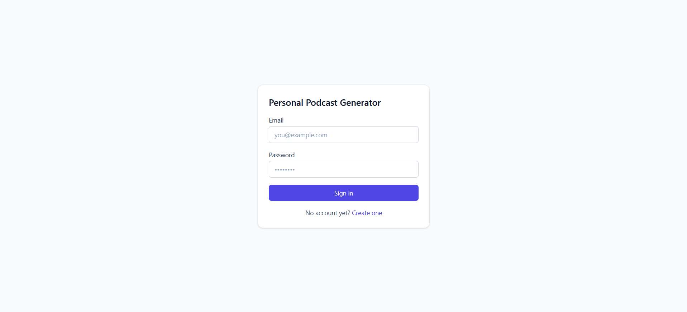 | **Sign up** — email, password, repeat password<br>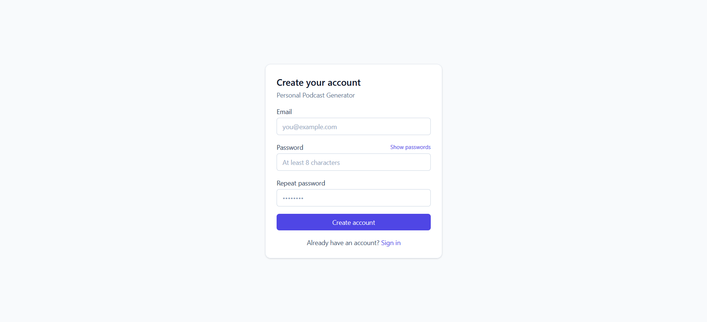 |
| **Interests** — four guided questions<br>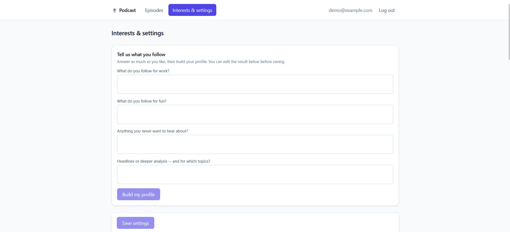 | **Your profile** — editable topics, include/exclude tags, depth<br>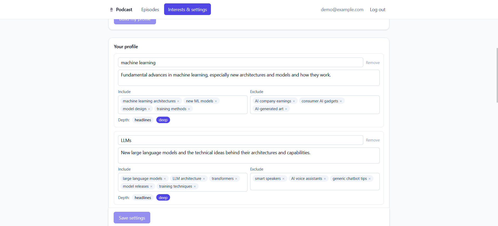 |
| **Podcast settings** — length, tone, hosts and voices, schedule<br>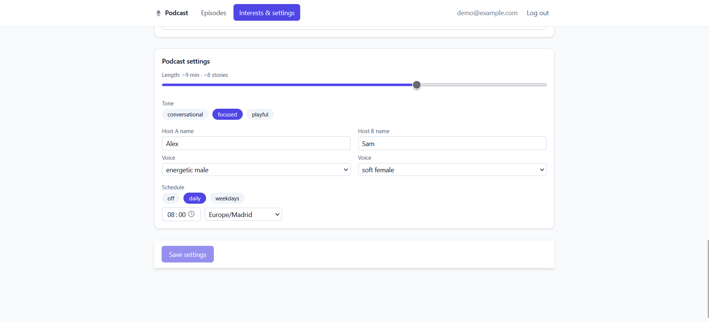 | **Episodes** — next run countdown, focus request, New / In progress / Played<br>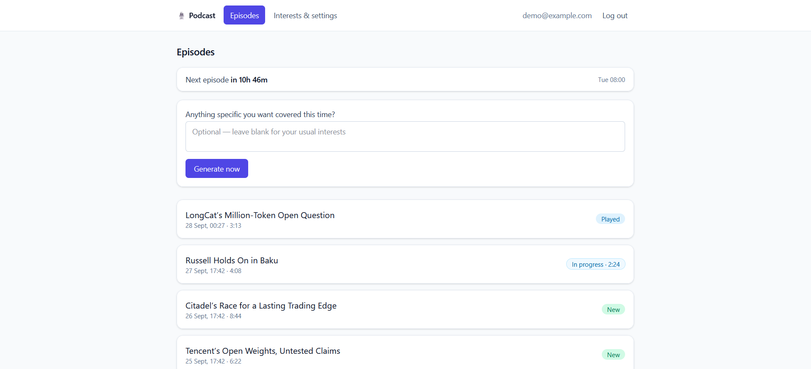 |
| **Episode** — player, speed, rating, transcript with sources<br>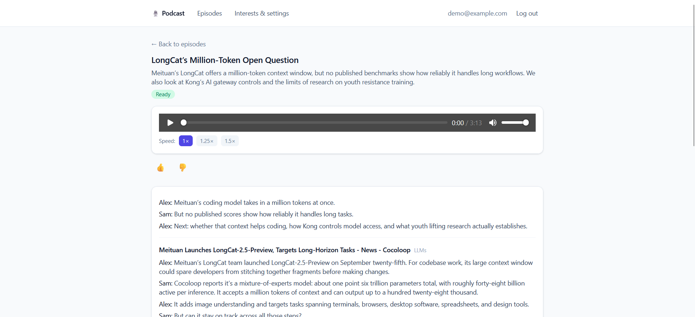 | **Admin dashboard** — date range, synthetic-data toggle, KPIs<br>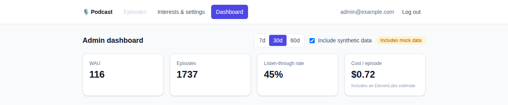 |
| **Dashboard: product** — activity, episodes, topics, retention, ratings<br>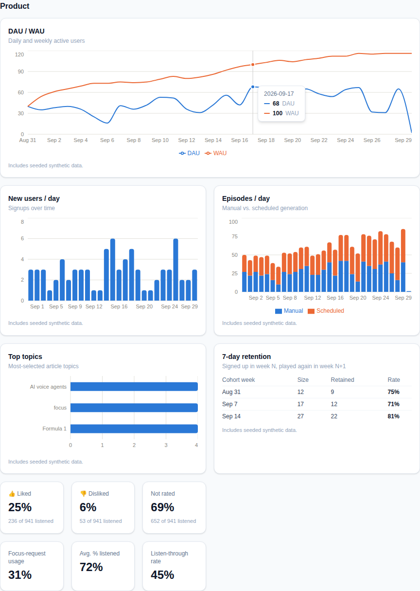 | **Dashboard: operations** — time and failure rate per stage, cost per provider<br>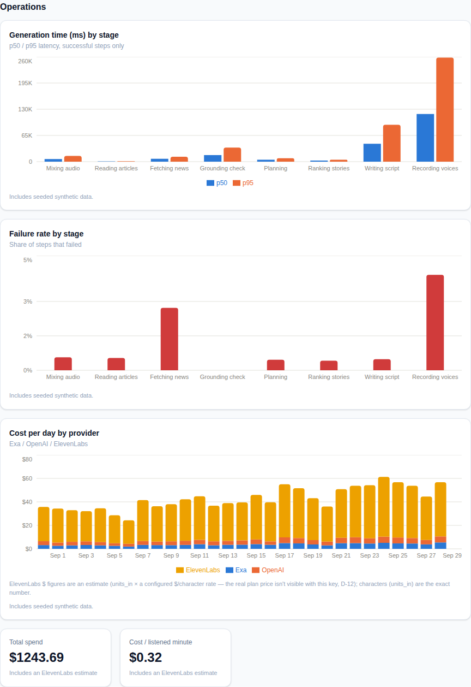 |
| **Dashboard: quality** — classifier eval, rating by prompt version, grounding flags<br>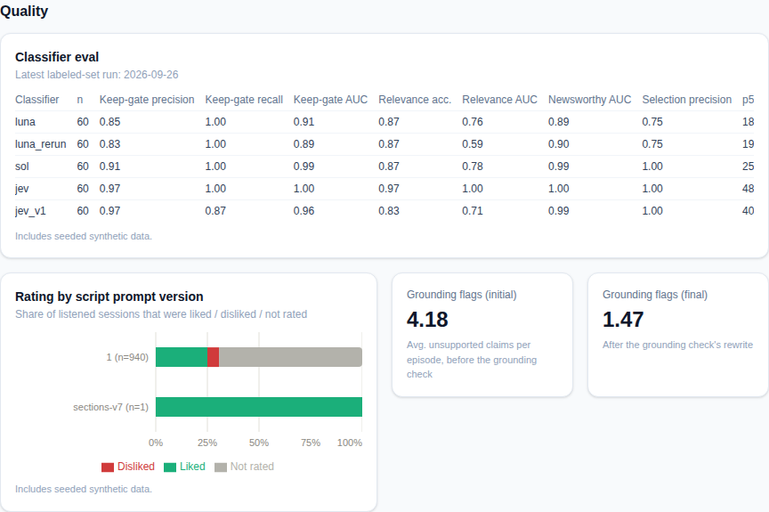 | **Operations, real rows only** — one episode generated on fake providers<br>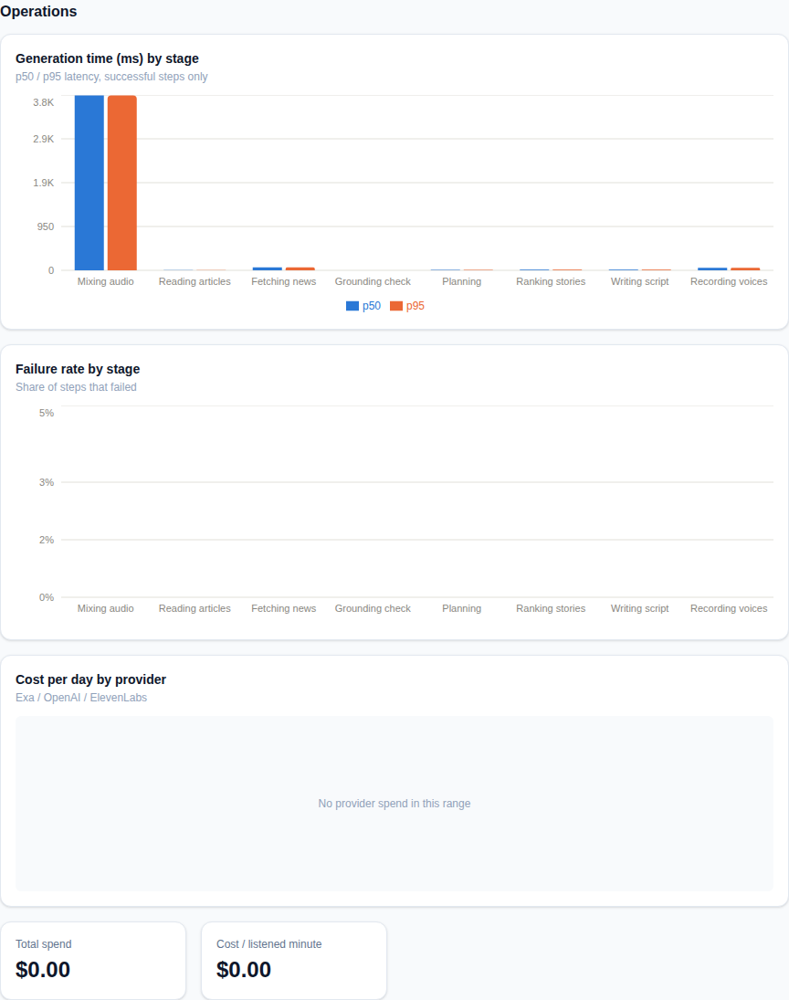 |

## More

Full command list, provider/cost rules, and coding conventions live in `CLAUDE.md`.
Design and decisions live in `docs/ARCHITECTURE.md` and `docs/DECISIONS.md`.
