# Personal Podcast Generator — Architecture

> Status: **v1.0, the design as built** (2026-09-29). It replaces v0.8, which still described the phase 05 system. Every change since v0.8 is listed in §0 with the decision that caused it. Diagrams are Mermaid, so GitHub renders them. Decisions live in `docs/DECISIONS.md`; the reasoning and trade-offs for reviewers live in `solution.md`.

## Contents
0. What changed since v0.8
1. Goals and priorities
2. Product decisions
3. System overview (diagrams)
4. Tech stack
5. Pipeline (diagrams)
6. Adapters
7. Data model (diagram)
8. Scheduling and restart behaviour (diagram)
9. API (diagrams)
10. Frontend (diagrams)
11. Dashboard metrics
12. Running it and deployment
13. Key trade-offs
14. Provider facts verified against the real APIs
15. Build phases and what is not built
16. Known limitations

---

## 0. What changed since v0.8

| Area | v0.8 said | As built | Why |
|---|---|---|---|
| Episode length | 3–12 min, default 6 | 6–20 min, default 10. Stories are budgeted in **minutes by topic depth** (deep 3.0, headlines 1.5), not a story count | D-65 |
| Script writer | One `gpt-6-sol` call, retry once | **Outline → sequential sections → frame.** Each section is fact-checked against its own sources and patched once. Story sections are never rewritten after grounding | D-59, D-62, D-65 to D-70 |
| Words per minute | 150 | 135 (measured: 973 words → 428 s) | D-28, D-59 |
| Intro | "Says the show is AI-generated" | No disclosure line. The intro never narrates the listener's request | D-63, D-69 |
| Classifier | `gpt-6-luna`, or Jev | **`gpt-6-sol`, reasoning none, `classifier.v2`** (dates + `is_stale`). Luna and Jev are one `.env` change away. Jev is wrapped in a per-article fallback | D-45, D-61 |
| Selection | Score × recency, top N per topic | Minutes budget, focus slot first, one story per topic before fill-by-score, per-topic cap, stale and covered dropped, undated articles decay as one half-life old | D-57, D-61, D-65 |
| Voicing | One chunk after another | **Chunks in parallel** (≤ 4 in flight process-wide), 429/5xx retry, batch spend pre-flight, per-user voices | D-56, D-58 |
| Runner | One DB transaction per run | **Commit per stage.** One in-progress episode per user is a partial unique index. Retry is a conditional `UPDATE` | D-37 |
| Restarts | Not specified | Recover every orphan, auto-resume once, one catch-up run, one hour misfire grace | D-38 |
| Auth | Seeded users + JWT | Also **self-service sign-up**. Audio and voice previews use short-lived **media tokens** | D-40, D-47 |
| Frontend | Four pages | Six routes. Sign-up, listening state and resume, rating undo, next-run countdown, polling every 3 s | D-41, D-46, D-47 |
| Dashboard | Metric list | Built. Rating breakdown is a true partition (liked + disliked + not rated = 100%) | D-51 to D-55 |
| `pipeline_steps` | 13 columns | Adds `usage_source`, `provider_request_id`, `fallback_count`. A `system` provider row records an interrupted run | D-16, D-38, D-44 |
| Grounding | One check at the end of scripting | One check **per section**, reason-first, also grounds audio tags | D-30, D-59, D-65, D-68 |
| Packaging | `docker compose up` | `docker compose up --build` runs db, api (migrates and seeds on start) and web (nginx). `docker-compose.fake.yml` runs it on fake providers with no keys | D-73 |

---

## 1. Goals and priorities

| Priority | What | Status |
|---|---|---|
| P0 | Pipeline that turns a user's interests into a good-sounding two-host MP3 | Built. `sample.mp3` is episode 6054 |
| P0 | `solution.md` explaining decisions and trade-offs | Written (D-72), awaiting the author's edits |
| P1 | UI: login, interests and podcast settings, episodes with player, "Generate now" with a focus request | Built |
| P1 | Scheduled generation | Built |
| P1 | Admin dashboard (real pipeline metrics + seeded mock usage) | Built |
| P2 | Classifier eval (Luna vs Sol vs Jev) and grounding check | Built. Results in `eval/results/` |
| P3 | Niche RSS, hosted deployment, episode memory | **Not built** (see §15) |

**Non-goals:** production-grade auth, horizontal scaling, a multi-worker job queue, a mobile app, a public RSS podcast feed.

## 2. Product decisions

| Decision | Value |
|---|---|
| Format | Two hosts. Defaults: **Alex** and **Sam**. Names and voices are user-configurable (9 curated voices). Both hosts report and interpret; neither is "the one who asks questions" (D-65) |
| Length | User-tunable, **6–20 minutes**, default 10. A one-off override per episode is allowed |
| Language | English |
| News source | Exa only |
| Personalization | An editable interest profile (topics with depth, include and exclude lists, an avoid list) plus an optional **focus request** per episode |
| Tone | `conversational`, `focused` or `playful` |
| Users | Seeded (admin, demo, eval) or self-service sign-up |

## 3. System overview

### 3.1 Containers

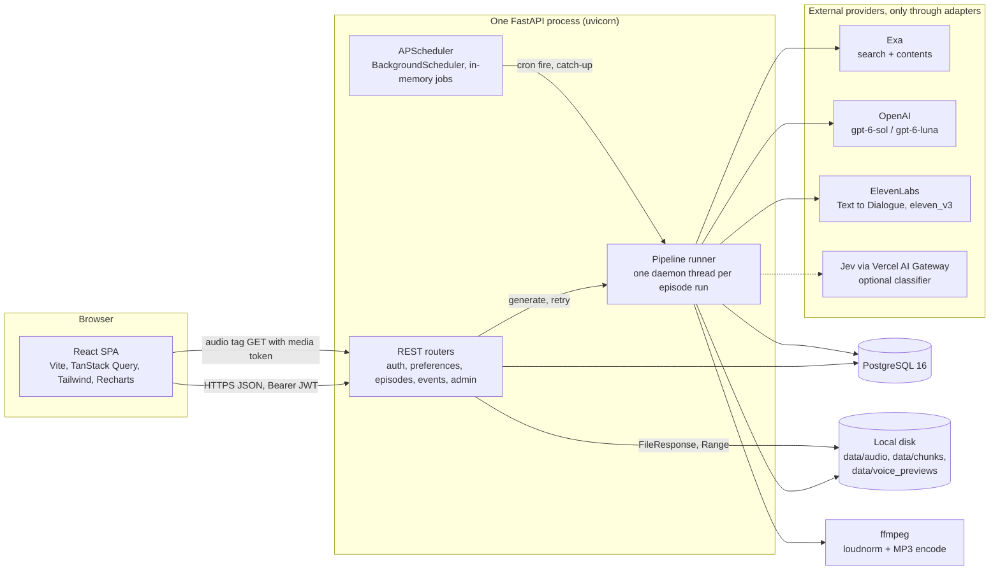

**Single process by design (D-02).** API, scheduler and pipeline share one FastAPI process and one Postgres. The seam for scaling (a queue and separate workers) is documented in `solution.md`, not built.

### 3.2 Threads and concurrency inside the process

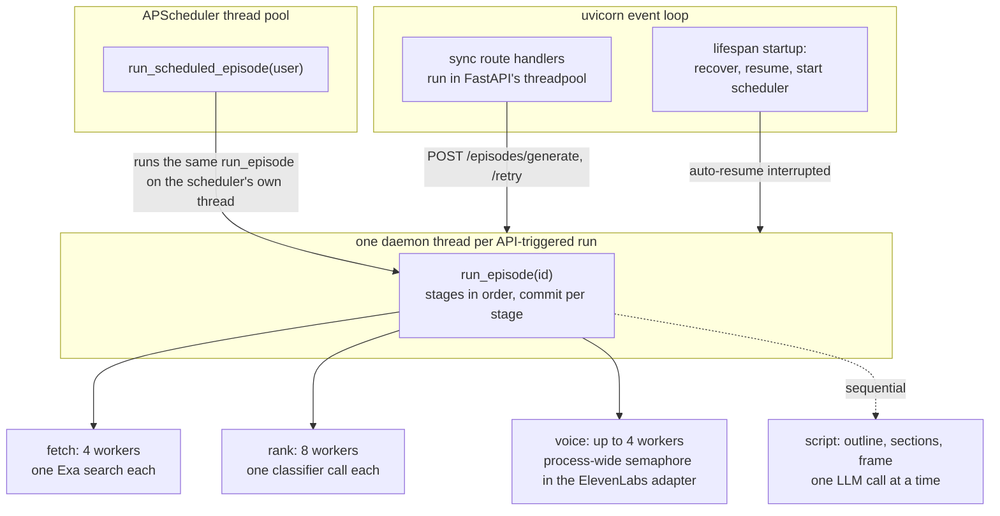

Rules that keep this safe: worker threads touch only adapters and the file system, never the SQLAlchemy session (fetch, rank, voice all write to the DB back on the run's own thread). Every run opens its own session (`session_scope()`).

## 4. Tech stack

| Layer | Choice | Reason |
|---|---|---|
| Backend | FastAPI, Python 3.12, SQLAlchemy 2 + Alembic, Pydantic v2, pydantic-settings, `uv` | Matches Prosper's stack |
| DB | PostgreSQL 16 | JSONB for profile, queries, script, flags; native enums; a partial unique index |
| Scheduler | APScheduler 3.x, in-process | No extra infra; fine for one instance |
| Providers | `exa-py`, `openai`, `elevenlabs` SDKs; `httpx` for Jev | Official SDKs behind adapters |
| Audio | `pydub` to join chunks, `ffmpeg` for `loudnorm` (−16 LUFS) and MP3 | Standard, scriptable |
| Auth | `pyjwt` (HS256), `passlib` + `bcrypt<4.1` | D-14, D-19 |
| Frontend | Vite + React 19 + TypeScript, React Router 7, TanStack Query 5, Tailwind 4, Recharts 3, oxlint | Mainstream, easy to explain (D-41) |
| Tests | `pytest` with fake adapters only; ruff | Tests never hit real APIs |

## 5. Pipeline

An episode moves through a status machine. `episodes.status` always means "the next stage to attempt" (or `ready` / `failed`), so **skipping completed stages and resuming from `failed_stage` need no extra bookkeeping** (`runner._start_index`).

### 5.1 Status machine

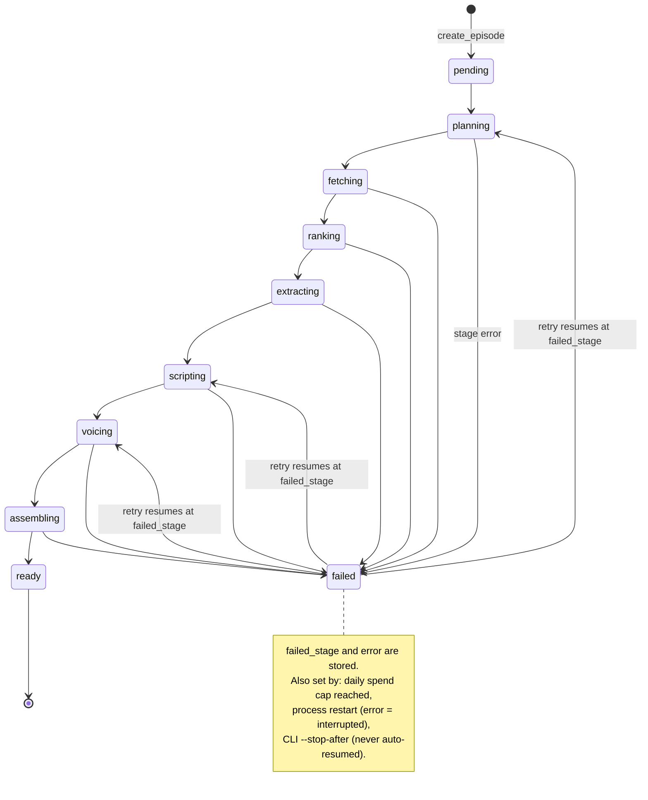

Every successful stage writes its output, writes a `pipeline_steps` row, sets the next status and **commits** (D-37). A crash keeps everything already paid for.

### 5.2 One run, end to end

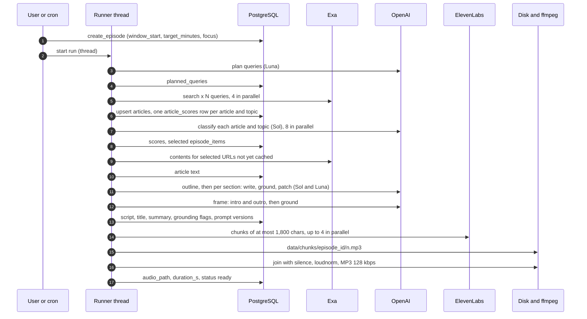

Each arrow that leaves the process is an adapter call that returns `(result, Usage)`; the runner turns each stage's `Usage` into a `pipeline_steps` row.

### 5.3 Interest profile (onboarding, editable any time)
- The user answers four guided questions (`GET /profile/questions`). `POST /profile/extract` sends them to `gpt-6-sol` (`profile_extractor.v1`) and returns a structured `InterestProfile` **without saving it**. Empty answers are rejected with a 422 before any LLM call (D-48).
- The user edits the profile as tags and saves it with `PUT /preferences`. It is stored in `preferences.interest_profile` (JSONB): `topics[] {name, description, include[], exclude[], depth: headlines|deep}` and `avoid[]`.

### 5.4 Plan (`planning`)
- Inputs: the profile, the optional focus request, the window start (last ready episode's `ready_at`, else now − 7 days), and the headlines of the last two ready episodes.
- `gpt-6-luna` (`query_planner.v1`) returns natural-language queries, each tagged with its topic (`focus` for the request). Recency goes **in the query text**. Stored in `episodes.planned_queries`.

### 5.5 Fetch (`fetching`, Exa `/search`)
- One request per query, the shape Exa recommends: `query`, `type: "auto"`, `contents: {"highlights": true}`, plus `startPublishedDate` for the window. No `category`, `numResults`, domain filters or `maxAgeHours` (D-07).
- If a query returns fewer than 3 results, retry once without the date filter and keep only results dated inside the window or undated. In real runs this never fired (D-21).
- Queries run 4 at a time. Results are upserted into the **shared `articles` table**, deduplicated by normalized-URL hash. One `article_scores` row is created per (article, topic) match.

### 5.6 Rank (`ranking`)
- One classifier call per (article, topic) row, 8 at a time. `classifier.v2` sees today's date, the window, the topic's description, include and exclude lists, the avoid list, and the last episodes' headlines. It returns `relevance` and `newsworthy` (0–1), `already_covered` and `is_stale`.
- `score = relevance × newsworthy × recency_decay`. Recency halves every 3 days; an **undated article counts as one half-life old** (D-57).
- Selection (`rank.select_stories`, pure and unit-tested):

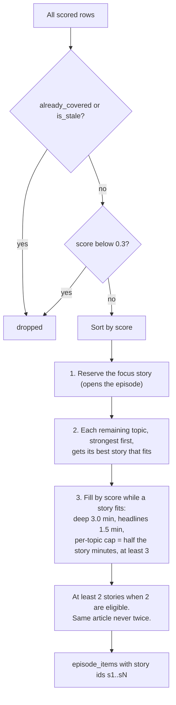

- Story minutes = episode minutes minus the frame (intro + outro, 12% of the words clamped to 120–200) (`pipeline/budget.py`).
- **Not built:** same-event collapsing before selection (D-22). The outline can merge duplicate coverage later (D-59).

### 5.7 Extract (`extracting`, Exa `/contents`)
- Only for selected articles whose `content` is still null, batched in one request. Articles already extracted for any earlier episode are reused for free (D-24).
- HTTP 200 can hide per-URL failures, so the adapter reads `statuses`. On failure the article stays on its highlights and keeps `content_source = "highlights"`.

### 5.8 Script (`scripting`), three steps inside one stage

There is no new status or table; `episode.script` is one `Script` that voicing and the transcript API read. Prompts in use: `outline.v6`, `section_writer.v7`, `section_patch.v3`, `frame.v5`, `grounding_check.v5`.

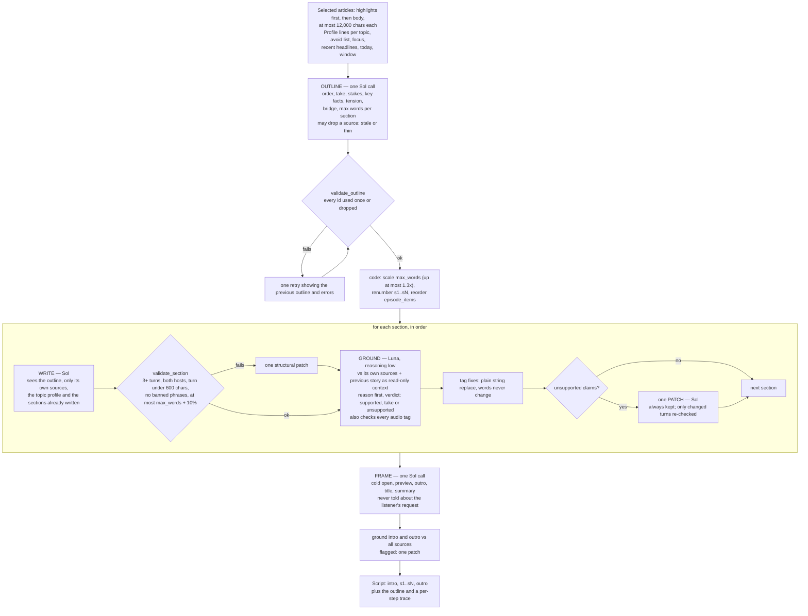

Key rules (details in D-59, D-62, D-65 to D-70):
- **The take.** The outline's `angle` is a declarative, arguable claim, never a question. `tension` (the best honest counterpoint) is set only when a source directly tests the take.
- **Grounding policy** (one identical block in writer, patch and grounder prompts, enforced by a unit test): every number, name, date, quote and event must come from the section's sources. Hosts may interpret, judge and compare without hedging, as long as they add no new specific.
- **Length is a ceiling.** Each section has `max_words`; only exceeding it by more than 10% is an error. A short section is fine. The total is only warned about outside ±20%.
- **Failure accounting.** A scripting failure carries the usage already spent, so the failed step still counts toward the daily cap (`ScriptingError`).
- **Debugging aid.** `SCRIPT_TRACE_DIR` writes every intermediate text and rendered prompt to disk (D-60). Off by default.
- The grounding calls are written to their own `pipeline_steps` row (`stage = "grounding"`), on top of the `scripting` row (D-30).

### 5.9 Voice (`voicing`, ElevenLabs Text to Dialogue, `eleven_v3`)

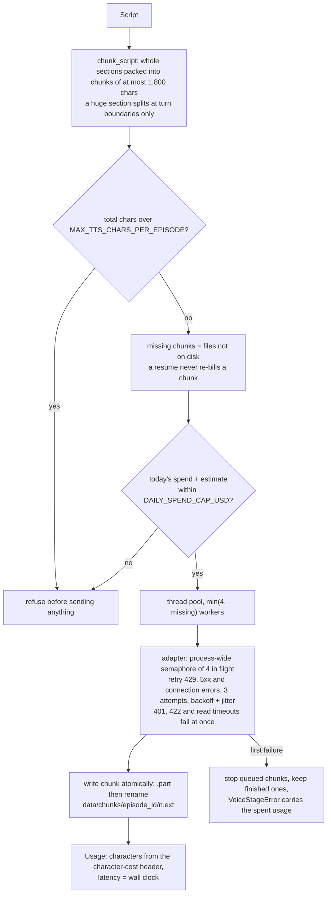

- The voices are resolved **once per episode**: the user's `preferences.host_a/host_b.voice_id`, else the `.env` default (D-58). The output format is `mp3_44100_128` by default (PCM needs a paid tier; D-26 covers the PCM path).
- The script may carry sparse v3 audio tags (`[chuckles]`); they are grounded (D-68) and stripped from the transcript shown in the UI.

### 5.10 Assemble (`assembling`)
Chunks are decoded, joined with 600 ms of silence between them and 1.5 s after the last one (D-71), exported to WAV, then `ffmpeg -af loudnorm` (−16 LUFS) and `libmp3lame` at 128 kbps, 44.1 kHz to `data/audio/{episode_id}.mp3`. `duration_s` includes the padding. Status becomes `ready`.

### 5.11 Every provider call is recorded
`pipeline_steps`: episode, stage, status, provider, model, `units_in`, `units_out`, `cost_usd`, `cost_is_estimate`, `usage_source`, `provider_request_id`, `fallback_count`, latency, timestamps, error. This one table feeds the operations metrics.

| Provider | `units_in` | `cost_usd` | Estimate? |
|---|---|---|---|
| Exa | results or URLs | Exa's own `costDollars` | no |
| OpenAI | input tokens | tokens × published price (`pricing.py`) | no |
| Vercel AI Gateway (Jev) | input tokens | the gateway's `marketCost` | no |
| ElevenLabs | characters, from the `character-cost` header | `characters × ELEVENLABS_USD_PER_1K_CHARS` | **yes** (D-12) |
| ffmpeg (`local`) | — | 0 | no |

### 5.12 Cost guardrails
- `MAX_TTS_CHARS_PER_EPISODE` (default 18,000) refuses an episode that is too long before any TTS spend.
- `DAILY_SPEND_CAP_USD` (default 5): the runner refuses to start a stage once today's non-synthetic spend reaches it, and voicing also checks the batch it is about to send.
- CLI flags for cheap iteration: `--minutes`, `--tts fake`, `--stop-after scripting`; `rescript <id>` re-runs only scripting on cached articles.

## 6. Adapters

Four `typing.Protocol` interfaces. Pipeline code never imports an SDK. Every call returns its result **and** a `Usage`. `get_adapters(settings, overrides)` builds them from config, so switching provider needs no code change.

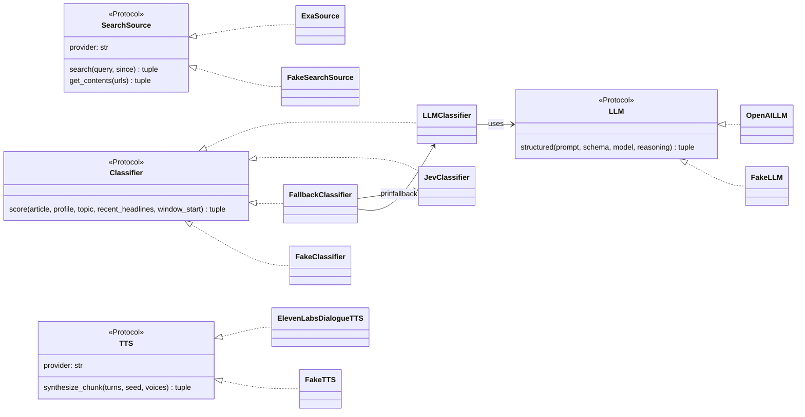

- `CLASSIFIER_PROVIDER=openai` (default) uses `LLMClassifier` with `MODEL_CLASSIFIER` (`gpt-6-sol`). `jev` uses `FallbackClassifier(JevClassifier, LLMClassifier)`: 502/503/504 are retried, a 429 pauses Jev for 5 minutes, and anything that still fails is scored by the OpenAI classifier and counted in `fallback_count` (D-45).
- `FakeSearchSource` rebases fixture dates to "now" so the recency gate keeps passing (D-49). `FakeLLM` sizes fake scripts from the prompt's word target.
- Runtime prompts are versioned files `app/prompts/<name>.v<N>.md`; the highest version loads, and the versions used are stored on the episode (`prompt_versions`). Old versions stay on disk as history. Jev's typed questions live in code (`jev.v2`), not in a prompt file.
- Model IDs, prices and voice IDs live in config and `pricing.py`, never inline.

## 7. Data model

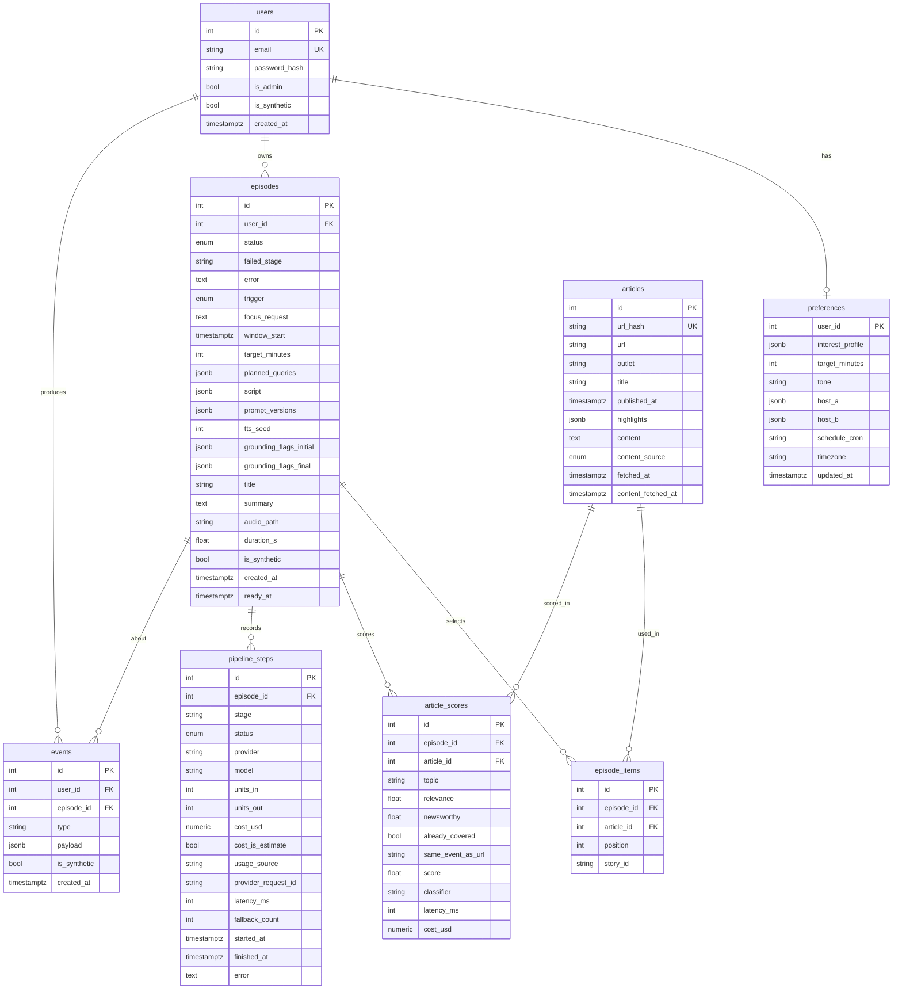

Notes that the diagram cannot show:
- **One in-progress episode per user** is a partial unique index: `uq_episodes_one_in_progress_per_user ON episodes(user_id) WHERE status NOT IN ('ready','failed')` (D-37). The API turns the violation into a 409; the scheduler skips.
- `episode_items (episode_id, article_id)` is unique. `article_scores` has one row per (episode, article, topic).
- `articles` is shared across users and episodes. It is the cache for both search results and extracted text (D-24). There is no refresh path for old content.
- `episodes.script` holds the whole `Script`: sections, the outline that produced them, and a per-step trace (step, words, flags, cost, latency).
- `events.type`: `login`, `signup`, `generate_clicked`, `profile_updated`, `settings_changed` are written by the server; the client may only send `play_started`, `play_progress`, `play_completed`, `episode_rated` (value 1, −1 or 0 = cleared). Ratings are append-only, and the latest one wins (D-40).
- `is_synthetic` marks seeded mock data so the dashboard can show real and mock honestly. Seeded users use `@synthetic.invalid` emails (D-51).
- Audio is on disk, not in Postgres: files serve `Range` requests for seeking (D-36).
- Migrations (Alembic): `1df08563f23c` initial schema, `a7c3e2d91f40` in-progress index, `c4e81b7f02d5` `fallback_count`, `e2b7a91c4d30` lift saved lengths below 6 to 6.

## 8. Scheduling and restart behaviour

- One APScheduler job per user with a `schedule_cron`, in the user's timezone. `PUT /preferences` re-syncs the job on every save. **Synthetic users are never scheduled** (D-51).
- A cron fire creates a `schedule` episode with the user's saved length (never an override) and runs the pipeline on the scheduler's own thread. `POST /episodes/generate` creates a `manual` episode and runs it on a daemon thread.
- `misfire_grace_time` is one hour, so a fire that runs late (laptop asleep) still happens, once.

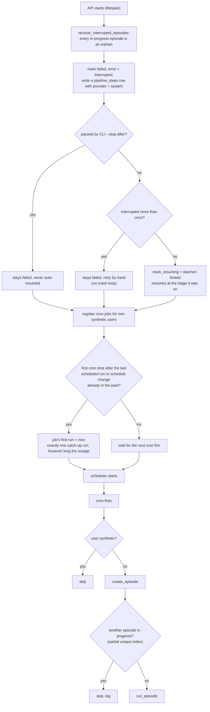

- Limitation: two API instances would run every job twice. Fix: a DB advisory lock, or a queue with a worker. Exa Monitors could run scheduled searches server-side but need a public webhook (rejected for a local-first build).

## 9. API

### 9.1 Routes

| Method and path | Auth | Purpose |
|---|---|---|
| `POST /auth/login` | none | Email + password → JWT. Email is trimmed and lowercased; a wrong login is always a generic 401 |
| `POST /auth/signup` | none | Creates the user and default preferences, returns a JWT (201). 409 if the email exists; password 8–72 chars (D-47) |
| `GET /me` | Bearer | User, `is_admin`, `has_profile` |
| `GET /profile/questions` | Bearer | The four guided-interview questions |
| `POST /profile/extract` | Bearer | Free-text answers → proposed profile (LLM, not saved) |
| `GET /preferences`, `PUT /preferences` | Bearer | Profile and podcast settings, plus computed `next_run_at`. `PUT` validates cron + timezone, tone, host names and voice ids, then re-syncs the scheduler |
| `GET /preferences/length-options` | Bearer | `[{minutes, stories}]` for the length slider, per user (D-65) |
| `GET /voices` | Bearer | 9 curated voices with tokenised preview URLs |
| `GET /voices/{id}/preview?t=` | media token | Preview MP3 |
| `GET /episodes` | Bearer | The caller's episodes with status, `played`, `completed`, `resume_position_s` |
| `POST /episodes/generate` | Bearer | `{focus_request?, target_minutes?}` → 201 with the id; 409 if one is in progress |
| `GET /episodes/{id}` | owner or admin | Detail: sections (heading, topic, turns, sources), `my_rating`, `audio_url`, steps |
| `POST /episodes/{id}/retry` | owner or admin | Resume from `failed_stage` (409 on double click) |
| `GET /episodes/{id}/audio?t=` | media token | MP3 with `Range` support |
| `POST /events` | Bearer | Player telemetry and ratings; the episode must be the caller's |
| `GET /admin/metrics?from&to&include_synthetic` | admin | Every dashboard metric |
| `GET /health` | none | `SELECT 1` |

Cross-user access is a 403, not a 404, on purpose (D-33). Bodies are validated by Pydantic before any handler runs (`EventCreate`, `PreferencesUpdate`, `ProfileExtractRequest`).

### 9.2 Layering

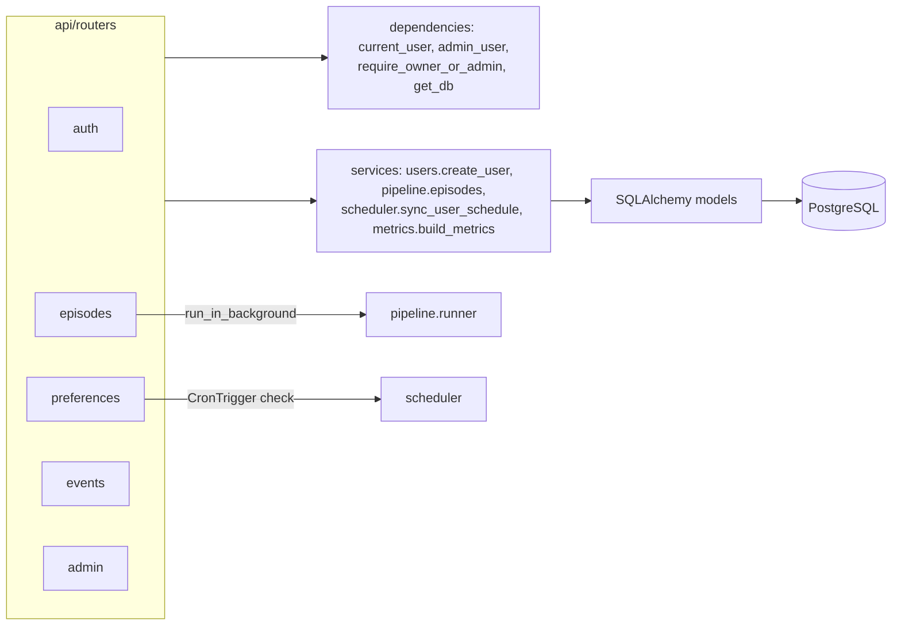

### 9.3 Auth and media tokens

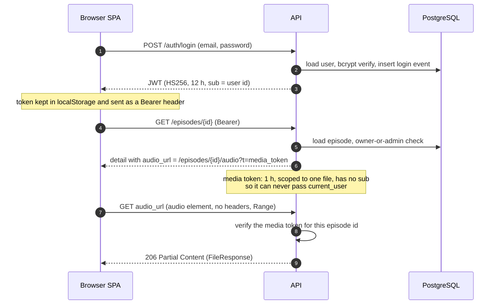

No refresh token and no revocation list: logging out just forgets the token, and a stolen one lives until it expires (D-33, accepted for this scope).

## 10. Frontend

`frontend/src`: `pages/`, `components/` (with `admin/` and `settings/`), `auth/`, `api/` (`client.ts`, hand-written `types.ts`), `lib/`. State is TanStack Query for server state and one React Context for auth. There is no global store (D-41).

### 10.1 Routes and layout

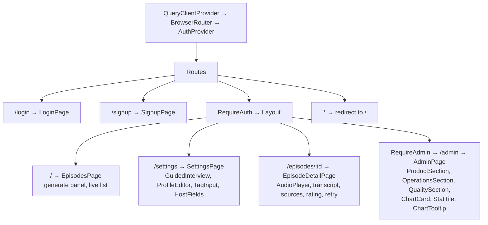

- `RequireAuth` sends anonymous users to `/login`. While `/me.has_profile` is false the Episodes nav item is disabled and the page shows a "set up your interests" card (D-46).
- Sign-up signs the user in at once and lands on Settings.

### 10.2 Data flow: generate, watch, listen

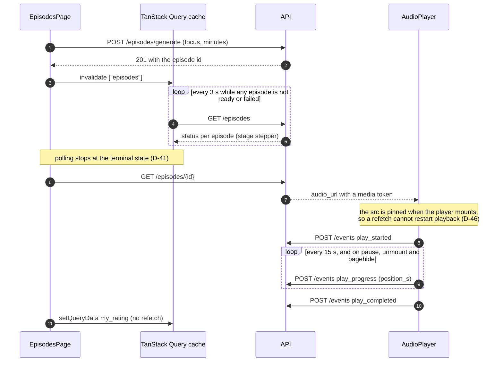

- "New / In progress m:ss / Played" and the resume point are derived from those events on the server (`_playback_state`). There is no extra column (D-46).
- The next scheduled run is a countdown from `next_run_at`, refreshed every 30 s.
- Buttons that are disabled for a reason show a `title` explaining why (D-50).

### 10.3 Admin dashboard

`AdminPage` holds only the date preset and the "include synthetic" toggle, and runs one query (`keepPreviousData`, so a filter change never blanks the page). Charts follow the project's dataviz rules: fixed colour per provider, a shared tooltip, a legend when there are 2+ series, and "Includes seeded synthetic data." shown under a chart only while the toggle is on (D-53).

## 11. Dashboard metrics

`app/metrics.py` splits each metric into a thin SQL fetch and a pure Python fold, so the folds are unit-tested on tiny literal data (D-52).

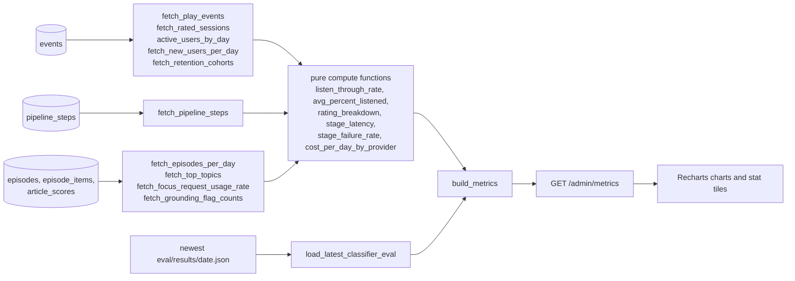

- **Product:** DAU and WAU, episodes per day (manual vs scheduled), listen-through rate, average % listened (a 0–1 fraction like every ratio, D-54), weekly-cohort retention (played in week 2 after sign-up), top topics (of selected stories), rating breakdown (liked, disliked, not rated, summing to 100% of listened sessions, D-55), focus-request usage.
- **Operations:** p50 and p95 latency per stage, failure rate per stage (an interrupted run shows as `system`), cost per episode by provider (the ElevenLabs slice is an estimate), cost per listened minute.
- **Quality:** classifier comparison table (from `eval/results`), average grounding flags initial and final, rating breakdown by script prompt version.
- **Success definition** (D-53): activation = a new user's first episode listened to at least 50%; retention = any play in week 2. Activation as a per-cohort rate is **not** on the dashboard yet.

## 12. Running it and deployment

- **Local (works):** `python scripts/setup.py` (installs `uv`, creates `.env`, syncs deps, starts Postgres with Docker Compose, migrates, seeds users and synthetic metrics), then `uv run uvicorn app.main:app --reload --reload-dir app` in `backend/` and `npm run dev` in `frontend/`. `ffmpeg` must be on `PATH`. See `README.md`.
- **Compose (whole app):** `docker compose up --build`, then open `http://localhost:5173` (D-73).
  - `db`: Postgres 16, a named volume, a health check.
  - `api`: built from the repo root with `backend/Dockerfile` (the dashboard reads `eval/results/*.json`). Python 3.12, `uv sync --frozen --no-dev`, `ffmpeg`. `backend/docker/entrypoint.sh` runs `alembic upgrade head`, `seed-users` and `seed-metrics` (set `SEED_METRICS=0` to skip), then uvicorn. Compose overrides `DATABASE_URL` (host `db`), `CORS_ORIGINS` and `DATA_DIR=/data` (a named volume for audio and chunks); keys come from `.env`, which is optional.
  - `web`: `frontend/Dockerfile` builds with Node 22 and serves `dist/` with nginx, falling back to `index.html` for client-side routes. `VITE_API_URL` is a build argument (default `http://localhost:8000`).
  - **No keys:** `docker compose -f docker-compose.yml -f docker-compose.fake.yml up --build` sets all four providers to fake. Episodes run the real pipeline on canned articles and scripts and produce silent audio.
- **Dev database only:** `python scripts/setup.py` still starts just `db`, for running the API and web app locally.
- **Seed accounts:** admin, demo and eval (`cli seed-users`), plus about 150 synthetic dashboard users (`cli seed-metrics`). Synthetic users cannot log in and are never scheduled.
- **Voice previews:** `GET /voices` returns a `preview_url` only if `data/voice_previews/{voice_id}.mp3` exists. Nothing in the repo generates those files, so on a fresh checkout the ▶ buttons have nothing to play.
- **Not built:** hosted deployment. A plan is in `solution.md` (next steps).

## 13. Key trade-offs (the full discussion is in `solution.md`)

| Decision | Chosen | Alternative | Why |
|---|---|---|---|
| Job execution | Daemon threads + in-process APScheduler | Celery/RQ + Redis; Exa Monitors | No extra infra; one instance is enough; the seam is documented |
| News source | Exa semantic search with a date window | NewsAPI-style aggregators; RSS | Any topic, full text, no source list to maintain |
| Fetch strategy | Highlights → classify → full text for selected only | Full text for everything | Classify on cheap excerpts; pay for text only where it is used |
| Classifier | `gpt-6-sol`, no reasoning | Luna (20× cheaper), Jev (cheaper and faster, unreliable) | Only Sol met the quality gates; Jev failed availability |
| Selection | Minutes budget, topic coverage, focus first | Score-only top N | Stops one topic taking every slot; length follows the depth the user chose |
| Script | Outline → sequential grounded sections → frame | One call | Each claim checked against its own sources; patches are targeted, not rerolls |
| Grounding | Reason-first per-section check, one patch, patch always kept | Compare drafts, revert | A tie used to keep the unpatched draft (D-62) |
| TTS | Text to Dialogue v3, ≤ 1,800-char chunks at story boundaries, parallel | One call per line or per episode; GenFM | Request-size limit; per-line loses turn-taking; GenFM is a black box |
| Audio storage | Filesystem | Postgres bytea / S3 | Simple, range requests; S3 when hosted |
| Auth | JWT + sign-up, media tokens for `<audio>` | OAuth; JWT in the URL | Not what is being evaluated; the 12 h token must never appear in a URL |
| Stage persistence | Commit per stage, resume from `failed_stage` | Restart the run | Never pay for TTS twice |
| Concurrency guard | Partial unique index | Check-then-insert in Python | Two concurrent callers cannot both pass |
| Mock data | Seeded rows flagged `is_synthetic` | Unflagged mock data | An honest dashboard |

## 14. Provider facts verified against the real APIs

Phase 00 confirmed the call shapes (D-09), and later phases added more:
1. **OpenAI:** `client.responses.parse(model, input, text_format, reasoning={"effort": ...})`; usage fields `input_tokens`, `output_tokens`, `output_tokens_details.reasoning_tokens`. The SDK's default timeout is 10 minutes, so the adapter sets 90 s and one retry (D-61).
2. **Exa:** `exa-py` uses snake_case kwargs and returns `cost_dollars`; `/contents` can return HTTP 200 with a failed status per URL. The date filter rarely changed result counts on active topics (D-21).
3. **ElevenLabs:** `api_key` must be passed explicitly. The `character-cost` response header is the exact billed count (D-12). The concurrency limit is on **simultaneous requests** (Free 2, Starter 3, Creator 5, Pro 10); this key accepted 4 (D-56). The SDK does not retry the streaming call the dialogue endpoint uses, so the adapter does. This project's key cannot read the account quota or the voice library (D-09), which is why the voice list is curated.
4. **Jev:** reachable only through Vercel AI Gateway (`/v1/evaluate`, model `typesafe-ai/jev`), not TypeSafe's own API (D-43). `marketCost` is the real price; `cost` reads 0 on free credits. About 86% of responses over the eval runs were 429 or 5xx (D-45).

## 15. Build phases and what is not built

| Phase | Deliverable | State |
|---|---|---|
| 00 Smoke test | Every provider called once | Done |
| 01 Scaffold | Repo, schema, config, adapters with fakes, CLI | Done |
| 02 Ingestion | Profile, planning, Exa search | Done |
| 03 Pipeline | Rank → extract → script → voice → assemble | Done |
| 04 Quality | Grounding check, classifier eval | Done (labels by hand, results in `eval/results/`) |
| 05 API + scheduler | Auth, routes, scheduler, retry, audio | Done (05b, 05c hardening) |
| 06 Frontend | Pages | Done (06b fixes, sign-up) |
| 07 Dashboard | Events, metrics, seed, charts | Done |
| 08 Polish + docs | Sample episode, packaging, README, `solution.md` | Done (Docker stack in D-73) |
| 10 Scripting v2 | Outline, sections, frame, editorial passes | Done (D-59 to D-70) |
| 09 Stretch | RSS, episode memory, hosted deployment, SSE, CI | **None built** |

## 16. Known limitations

Single instance only (double-run risk) · no auth hardening (no refresh, no revocation, no rate limiting, open sign-up spends real money up to the daily cap) · no same-event collapsing before selection · the classifier prompt version is not stored on the episode · resuming voicing can mix two voices if the user changes a voice between attempts (D-58) · restart recovery can resume an episode a live CLI is working on (D-59) · article text is never refreshed (D-24) · Jev never returns `is_stale` (D-61) · the seeded episodes and metrics are synthetic · no hosted deployment · voice preview files are never generated. Each is discussed, with a fix, in `solution.md`.
