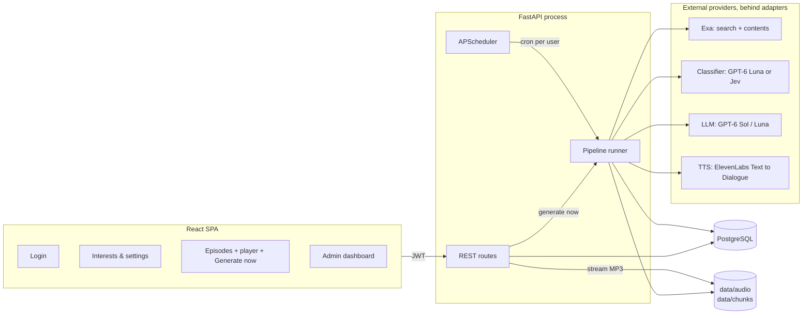

# Personal Podcast Generator — Architecture

> Status: **v0.8**. Phase 00 (smoke test) confirmed the provider call shapes below; see `docs/DECISIONS.md` D-09. Phase 05 confirmed Starlette's `FileResponse` handles `Range` requests natively (see D-36), resolving the last open **[VERIFY]** item.

## 1. Goals and priorities

| Priority | What | Why |
|---|---|---|
| P0 | Pipeline that turns a user's interests into a good-sounding two-host MP3 | This is what gets judged (`sample.mp3`) |
| P0 | `solution.md` explaining decisions and trade-offs | Explicitly evaluated |
| P1 | UI: login, interests and podcast settings, episodes with player, "Generate now" with an optional focus request | Required by the brief |
| P1 | Scheduled generation | Required by the brief |
| P1 | Admin dashboard (real pipeline metrics + seeded mock usage) | Required by the brief |
| P2 | Classifier eval (GPT-6 Luna vs Jev) and grounding check | Strong talking points, cheap to add |
| P3 | Niche tuning (curated RSS), hosted deployment, episode memory | Only if time remains |

**Non-goals:** production-grade auth, horizontal scaling, multi-worker job queue, mobile app, public RSS podcast feed.

## 2. Product decisions

| Decision | Value |
|---|---|
| Format | Two hosts. Default personas: **Alex** (anchor, structured, sets up each story) and **Sam** (curious co-host, asks the listener's questions, reacts). Names and voices are user-configurable. |
| Length | User-tunable, 3–12 minutes, default 6. |
| Language | English. |
| News source (v1) | Exa only. RSS niche feeds are a later tuning step. |
| Tooling | Backend: `uv`, `ruff`, `pytest`. Frontend: npm + Vite. |

## 3. System overview



**Single process by design:** API, scheduler and pipeline run in one FastAPI process with one Postgres. The seam for scaling (a job queue with separate workers) is documented, not built.

## 4. Tech stack

| Layer | Choice | Reason |
|---|---|---|
| Backend | FastAPI, Python 3.12, SQLAlchemy 2 + Alembic, Pydantic v2, pydantic-settings | Matches Prosper's stack |
| DB | PostgreSQL 16 | Matches Prosper's stack; JSONB for profile, queries, script |
| Scheduler | APScheduler, in-process | No extra infra; fine for one instance |
| Providers | `exa-py`, `openai`, `elevenlabs` SDKs, wrapped in adapters | Official SDKs; adapters keep them swappable and testable |
| Audio | ffmpeg (concat + `loudnorm`), pydub for glue | Standard, scriptable |
| Frontend | Vite + React + TypeScript, React Router, TanStack Query, Tailwind, Recharts | Mainstream, easy to generate and explain |
| Packaging | docker-compose (db, api, web) | One-command local run |

## 5. Pipeline

An episode moves through a status machine. Each stage persists its output, so a failure resumes from the failed stage (and never pays for TTS twice).

```
pending → planning → fetching → ranking → extracting → scripting → voicing → assembling → ready
                                                                    ↘ failed (failed_stage + error recorded)
```

### 5.0 Interest profile (onboarding, once; editable any time)
- The user answers 3–4 guided prompts ("What do you follow for work?", "…for fun?", "Anything you never want to hear about?", "How deep: headlines or analysis?").
- `gpt-6-sol` extracts a structured profile (runtime prompt `profile_extractor`):
  ```json
  {"topics": [{"name": "AI voice agents", "description": "voice AI products, models, funding",
               "include": ["voice agent", "speech AI"], "exclude": ["smart speakers"], "depth": "deep"}],
   "avoid": ["celebrity gossip"]}
  ```
- The user reviews and edits it as tags. Stored in `preferences.interest_profile` (JSONB).

### 5.1 Plan (every episode)
- Inputs: profile, optional **focus request** ("this week I want to know about X"), window start (last ready episode, else now − 7 days), headlines of the last 2 episodes.
- `gpt-6-luna` (runtime prompt `query_planner`) returns ~2 natural-language queries per topic plus 2–3 for the focus request, each tagged with its topic. Recency goes **in the query text** ("latest", "this week").
- Stored in `episodes.planned_queries`.

### 5.2 Fetch (Exa `/search`, following Exa's official guidance)
- One request per query, the recommended shape plus one justified field:
  ```json
  {"query": "latest news on AI voice agent startups this week", "type": "auto",
   "contents": {"highlights": true}, "startPublishedDate": "<window start, ISO 8601>"}
  ```
- `startPublishedDate` is justified: the product has a stated window ("since your last episode") that must be enforced. It drops undated pages, so **if a query returns fewer than 3 results, retry once without it** (recency stays in the query) and keep only results with `publishedDate` inside the window or missing.
- **Do not set** `category`, `numResults` (default 10 is fine), domain filters or `maxAgeHours`. Exa's docs flag these as the most common integration mistakes.
- Record `costDollars` from each response as the exact Exa cost.
- Upsert into the shared `articles` table, deduplicated by `url_hash` (normalized URL). Articles are shared across users; this is the cache.

### 5.3 Rank / select
- Classifier (`gpt-6-luna` reasoning `none`, or Jev) scores each candidate from **title + highlights** (cheap): relevance per topic (0–1), newsworthy vs PR/listicle/evergreen, already covered (given recent headlines).
- Score = relevance × newsworthiness × recency decay. Select to fit the budget: ~1 story per 1.2 minutes, per-topic cap for variety, near-duplicate stories collapsed (same event from several outlets → keep the best, remember the others as extra sources).
- Focus-request items get a reserved slot and open the episode.
- Every score is stored in `article_scores` with classifier name, latency and cost.

### 5.4 Extract (Exa `/contents`)
- Only for the ~4–8 selected URLs: `POST /contents` with top-level `"text": true` (full text; the script needs broad context, which highlights don't give).
- HTTP 200 can hide per-URL failures: always read `statuses`. On failure, fall back to the highlights already stored and mark the article `content_source = "highlights"`.
- Text is truncated per article (~6,000 chars) before scripting.

### 5.5 Script
- Budget: `target_minutes × 150` words (≈ × 6 characters).
- `gpt-6-sol` (reasoning `medium`, runtime prompt `script_writer`) gets only selected articles (id, title, outlet, date, text), host personas, tone, and the focus request.
- Structured output (Pydantic):
  ```json
  {"title": "...", "summary": "...",
   "sections": [
     {"kind": "intro", "story_id": null, "source_ids": [],
      "turns": [{"speaker": "host_a", "text": "..."}, {"speaker": "host_b", "text": "..."}]},
     {"kind": "story", "story_id": "s1", "source_ids": ["a12", "a15"], "turns": [...]},
     {"kind": "outro", "story_id": null, "source_ids": [], "turns": [...]}
   ]}
  ```
- Validation: schema-valid; word count within ±15% of budget; every `story` section cites ≥ 1 selected article; only `host_a`/`host_b`; no turn over ~600 characters. On failure, retry once with the validation errors appended.
- Grounding rule in the prompt: no facts that are not in the provided articles; attribute claims to outlets.
- The intro says the show is AI-generated. Source links go in the episode notes, not read aloud.

### 5.6 Voice (ElevenLabs Text to Dialogue, `eleven_v3`)
- **Chunking:** ElevenLabs recommends ≤ 2,000 characters per dialogue request. Pack whole sections into chunks of ≤ ~1,800 characters; split inside a section only at a turn boundary if the section alone is too long. Boundaries therefore fall on story changes, where a small prosody shift sounds natural.
- One request per chunk with a fixed `seed` and the user's two voices. v3 has no request stitching, so the boundary strategy is the mitigation.
- Script turns may carry sparse v3 audio tags (`[laughs]`, `[curious]`); tags are stripped from the transcript shown in the UI.
- Chunk audio is saved to `data/chunks/{episode_id}/{n}.*`; a failed or bad chunk is regenerated alone.
- Output format: PCM 44.1 kHz — confirmed available on this plan in phase 00.
- Output is nondeterministic: for `sample.mp3`, generate 2–3 takes and pick the best.
- Fallback adapter (not built unless needed): per-turn `eleven_multilingual_v2` with request stitching.

### 5.7 Assemble
- Concatenate chunks with ~600 ms of silence at section boundaries; ffmpeg `loudnorm` to −16 LUFS (podcast standard); export MP3 (128 kbps, 44.1 kHz) to `data/audio/{episode_id}.mp3`.
- Store duration and path. Mark `ready`; emit `episode_generated`.

### 5.8 Every provider call records
`pipeline_steps`: episode_id, stage, status, provider, model, units_in, units_out (tokens or characters), cost_usd, cost_is_estimate, latency_ms, started_at, finished_at, error. This one table feeds every operational metric. Exa returns its own `costDollars` (exact); OpenAI cost is exact token counts × published prices; ElevenLabs `units_in` is exact (the `character-cost` response header, confirmed in phase 00 — see D-12), but `cost_usd` is `units_in × ELEVENLABS_USD_PER_1K_CHARS`, a config estimate, since the real plan price isn't visible with this key. `cost_is_estimate` is `false` for Exa/OpenAI rows, `true` for ElevenLabs rows. All computed in `app/pricing.py`.

### 5.9 Cost guardrails
- `MAX_TTS_CHARS_PER_EPISODE` (default 12,000) and `DAILY_SPEND_CAP_USD` (default 5): the runner refuses to start a stage that would exceed them.
- CLI flags for cheap iteration: `--minutes 1`, `--tts fake`, `--stop-after scripting`.

## 6. Adapters

Thin `typing.Protocol` interfaces, one real implementation each, plus a fake for tests. Every call returns its result **and** a `Usage` (units in/out, cost_usd, latency_ms, provider, model).

```python
class SearchSource(Protocol):          # ExaSource, FakeSearchSource
    def search(self, query: str, since: datetime | None) -> tuple[list[RawArticle], Usage]: ...
    def get_contents(self, urls: list[str]) -> tuple[dict[str, ContentResult], Usage]: ...

class LLM(Protocol):                   # OpenAILLM, FakeLLM
    def structured(self, prompt: RenderedPrompt, schema: type[BaseModel], model: str,
                   reasoning: str) -> tuple[BaseModel, Usage]: ...

class Classifier(Protocol):            # LLMClassifier (wraps LLM), JevClassifier, FakeClassifier
    def score(self, article: Article, profile: InterestProfile, topic: str,
              recent_headlines: list[str]) -> tuple[ArticleScore, Usage]: ...
    # `topic` (added phase 03, D-23): fetch already tags each candidate with the
    # one topic that found it (D-21); the classifier scores against that
    # specific topic rather than re-picking one from the whole profile.

class TTS(Protocol):                   # ElevenLabsDialogueTTS, FakeTTS (silence of the right length)
    def synthesize_chunk(self, turns: list[Turn], seed: int | None) -> tuple[bytes, Usage]: ...
```

Provider and model selection come from config, so switching needs no code change. Runtime prompts are versioned files in `backend/app/prompts/` (e.g. `script_writer.v1.md`); the version used is stored on each episode.

## 7. Data model

```
users            id, email, password_hash, is_admin, is_synthetic, created_at
preferences      user_id (PK/FK), interest_profile JSONB, target_minutes (3–12, default 6), tone,
                 host_a JSONB {name, voice_id}, host_b JSONB {name, voice_id},
                 schedule_cron, timezone, updated_at
articles         id, url_hash (unique), url, outlet, title, published_at, highlights, content,
                 content_source (text|highlights), fetched_at, content_fetched_at
article_scores   id, episode_id, article_id, topic, relevance, newsworthy, already_covered,
                 same_event_as_url, score, classifier, latency_ms, cost_usd, created_at
episodes         id, user_id, status, failed_stage, error, trigger (schedule|manual), focus_request,
                 window_start, target_minutes, planned_queries JSONB, script JSONB, prompt_versions JSONB,
                 tts_seed, grounding_flags_initial, grounding_flags_final,
                 title, summary, audio_path, duration_s, is_synthetic, created_at, ready_at
episode_items    episode_id, article_id, position, story_id
pipeline_steps   id, episode_id, stage, status, provider, model, units_in, units_out,
                 cost_usd, cost_is_estimate, latency_ms, started_at, finished_at, error
events           id, user_id, episode_id, type, payload JSONB, is_synthetic, created_at
                 (login, profile_updated, settings_changed, generate_clicked, play_started,
                  play_progress, play_completed, episode_rated)
```

`is_synthetic` marks seeded mock data, so the dashboard can show real vs mock honestly. Audio lives on disk, not in Postgres (big binaries bloat the DB; files serve range requests for seeking -- confirmed in phase 05 that Starlette's `FileResponse` handles `Range` natively, see D-36).

## 8. Scheduling
- On startup, register an APScheduler job per user from `schedule_cron`; re-register when settings change.
- Per-user guard: no new episode while one is in progress (a partial unique index, D-37).
- Restarts (D-38): on boot every in-progress episode is an orphan, so it is marked failed ("interrupted") and auto-resumed once from its stage; a cron fire missed while the process was down triggers exactly one catch-up run; `misfire_grace_time` is one hour so a late fire (e.g. after laptop sleep) still runs.
- `POST /episodes/generate` runs the same pipeline as a background task.
- Limitation for `solution.md`: two API instances would run jobs twice. Fix: DB advisory lock or a queue with a worker. Exa Monitors could run scheduled searches server-side, but need a public webhook; rejected for a local-first build.

## 9. API

```
POST /auth/login                          → JWT
GET  /me
GET  /profile/questions                   the guided interview questions
POST /profile/extract                     free-text answers → proposed profile (not saved)
GET  /preferences    PUT /preferences     profile + podcast settings (+ computed next_run_at)
GET  /preferences/length-options          [{minutes, stories}] for the length slider's estimate
GET  /voices                              curated voice list with tokenised preview URLs
GET  /voices/{id}/preview?t=              preview MP3, media token instead of Bearer (D-40)
GET  /episodes       GET /episodes/{id}   status; detail adds sections (story heading, turns,
                                          sources), my_rating, audio_url, steps
POST /episodes/generate                   {focus_request?, target_minutes?} → episode id
POST /episodes/{id}/retry                 resume from failed stage
GET  /episodes/{id}/audio?t=              MP3, range requests, media token from audio_url (D-40)
POST /events                              player telemetry and ratings (rating 0 = cleared)
GET  /admin/metrics?from&to&include_synthetic   admin only
```

## 10. Frontend

| Page | Content |
|---|---|
| Login | Email + password against seeded users |
| Interests & settings | Guided interview → extracted profile as editable tags; length slider (3–12 min); tone; host names and voices with preview; schedule |
| Episodes | "New episode" panel with optional focus request + Generate now; list with live status; detail with player, transcript, sources, 👍/👎 |
| Admin dashboard | Admin-only route; charts below; toggle to include/exclude synthetic data |

## 11. Dashboard metrics
- **Product:** DAU/WAU, episodes per day, listen-through rate (completed / started), average % listened, 7-day retention, top topics, rating ratio, focus-request usage rate.
- **Operations:** generation time p50/p95 per stage, failure rate per stage, cost per episode by provider (Exa / OpenAI / ElevenLabs; the ElevenLabs slice is a `cost_is_estimate=true` estimate, labelled as such — characters are the exact metric, dollars are not, see D-12), cost per listened minute.
- **Quality:** classifier comparison (agreement, accuracy on the labeled set, latency, cost), grounding-check flag rate, prompt version vs rating.

## 12. Deployment
- **Default:** `docker compose up` → db, api, web. Secrets in `.env` (gitignored).
- **Stretch:** frontend on GitHub Pages, API on AWS free tier. Costs: HTTPS for the API, CORS, secrets, persistent audio (S3). ~2–3 h. Decide after session 2.

## 13. Key trade-offs (seed for `solution.md`)

| Decision | Chosen | Alternative | Why |
|---|---|---|---|
| Job execution | In-process APScheduler | Celery/RQ + Redis; Exa Monitors | No extra infra; one instance is enough; seam documented |
| News source | Exa semantic search with date window | NewsAPI-style aggregators; RSS scraping | Any topic, full text, no source list to maintain; aggregators are snippet-only or dev-only on free tiers |
| Fetch strategy | Search with highlights → classify → `/contents` text for selected only | Full text for every result | Classify on cheap excerpts, pay for full text only where it's used |
| Article selection | Classifier probabilities (Luna / Jev) | Embedding similarity (pgvector) | Direct, explainable scores; no threshold tuning |
| Script format | Structured JSON sections with source ids | Free text | Validatable, grounded, maps to TTS chunks |
| TTS | Text to Dialogue (v3), ≤ 1.8k-char chunks at story boundaries | One call per episode / per line / GenFM | Request-size limit; per-line loses turn-taking (no stitching on v3); GenFM is a black box |
| Audio storage | Filesystem | Postgres bytea / S3 | Simple, range requests; S3 when hosted |
| Auth | Seeded users + JWT | OAuth / managed auth | Not what's being evaluated |
| Stage persistence | Resume from failed stage | Restart whole run | Never pay for TTS twice |
| Mock data | Seeded rows flagged `is_synthetic` | Unflagged mock data | Honest dashboard; real vs mock is visible |

## 14. Open items verified in phase 00
1. OpenAI: all three model IDs (`gpt-6-sol`, `gpt-6-luna`, `gpt-6-astra`) exist on the key; `responses.parse(..., text_format=..., reasoning={"effort": "none"})` works as documented; usage fields are `input_tokens`, `input_tokens_details` (`cache_write_tokens`, `cached_tokens`), `output_tokens`, `output_tokens_details` (`reasoning_tokens`), `total_tokens`.
2. Exa: SDK call shapes confirmed (snake_case kwargs, `cost_dollars` not `costDollars`, no SDK-level `request_id`); date filter made no result-count difference on a fast-moving topic (both hit the 10-result default).
3. ElevenLabs: Text to Dialogue SDK call confirmed, including that `api_key` must be passed explicitly (not auto-read from env). **Character quota could not be read** — this project's key is a scoped take-home-test key (401 on `user_read` and `voices_read`); voice selection fell back to verified premade voices. PCM (`pcm_44100`) confirmed available. Voices chosen: Antoni (host_a/Alex) + Rachel (host_b/Sam).
4. Jev: `TYPESAFE_API_KEY` is set, but no SDK/request shape is documented anywhere in this repo, so `jev_check.py` was cut (phase 00's own "cut first" item) — deferred to phase 04, which will need to research the Typesafe/Jev API before writing the adapter.

## 15. Build phases

| Phase | Session | Deliverable |
|---|---|---|
| 00 Smoke test | 1 | Every provider called once; provider `[VERIFY]` items resolved; voices picked |
| 01 Scaffold | 1 | Repo, docker-compose, schema + migrations, config, adapters with fakes, CLI skeleton |
| 02 Ingestion | 1 | Profile extraction, query planning, Exa search, dedupe, CLI `plan` / `fetch` |
| 03 Pipeline | 1 | Rank → extract → script → voice → assemble; CLI `generate` → first MP3 |
| 04 Quality | 1 | Grounding check, classifier eval (Luna vs Sol vs Jev) |
| 05 API + scheduler | 2 | Auth, routes, scheduler, generate/retry, audio streaming |
| 06 Frontend | 2 | Four pages |
| 07 Dashboard | 2 | Events, metrics endpoint, seed script, charts |
| 08 Polish + docs | 2 | Voice/prompt tuning, `sample.mp3`, `README.md`, `solution.md` |
| 09 Stretch | 3 | Niche RSS, deployment, episode memory |
