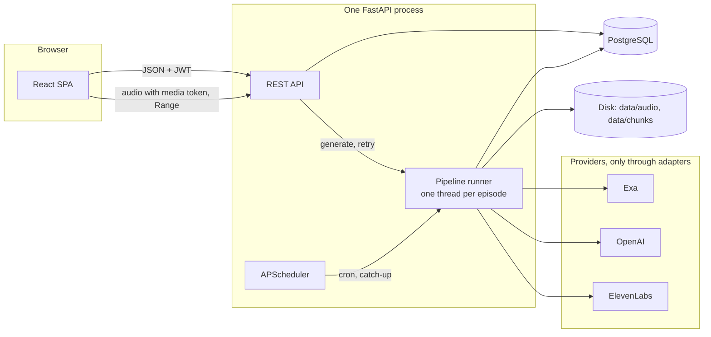
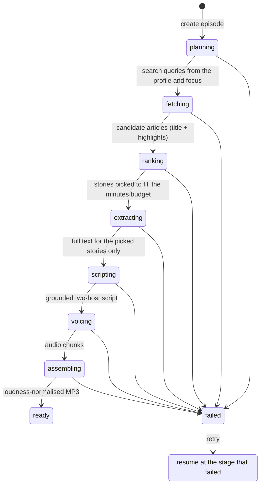
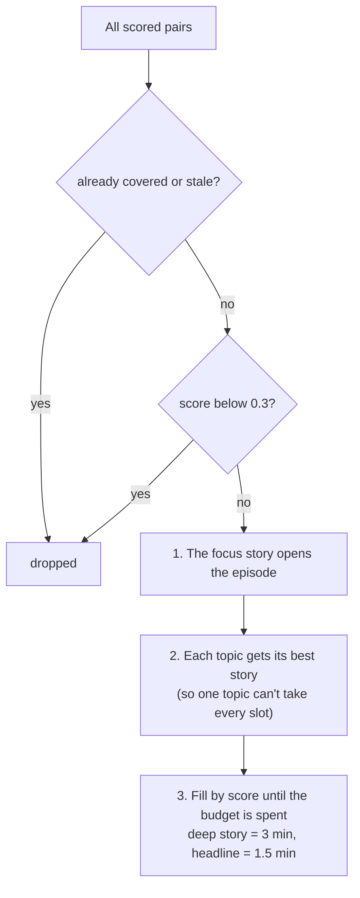
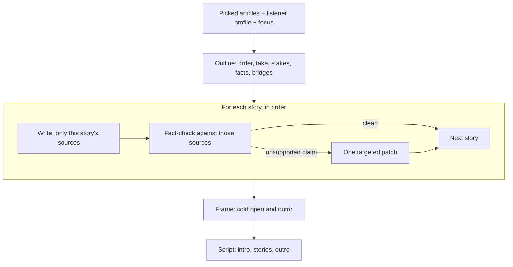

# Personal Podcast Generator — solution overview, architecture and trade-offs

> **AUTHOR NOTES — delete this box before submitting.**
> - Cost and time numbers in [section 3.7](#37-what-an-episode-costs-and-how-long-it-takes) are built from every saved real run: 2 full episodes (2875, 6054), 9 traced scripting runs (`data/tmp/*/calls.json`) and the voicing benchmarks in D-56. To replace them with fresh numbers, run `uv run --project backend python scripts/measure_costs.py run` from the repo root (4 × 10-minute episodes stopped after scripting, about $2.20, no ElevenLabs credit), then paste the medians it prints into the [section 3.7](#37-what-an-episode-costs-and-how-long-it-takes) table.
> - `sample.meta.json` records $0.294 for voicing, but the sample's transcript is 6,684 characters, which is $0.735 at the configured $0.11/1k. The most likely cause is a voicing run interrupted by a restart: chunks finished before it are on disk but their cost was never recorded (a known gap in how interrupted runs are billed). **[CONFIRM]** that this matches what happened, or re-export the meta.
> - Places where I (Claude) inferred your reasoning are marked **[CONFIRM]**.

## Contents
0. [TL;DR](#0-tldr)
1. [Product and scope](#1-product-and-scope)
2. [Tech stack](#2-tech-stack)
3. [How an episode is made](#3-how-an-episode-is-made)
4. [Dashboard: what success means](#4-dashboard-what-success-means)
5. [Architecture in brief](#5-architecture-in-brief)
6. [Trade-offs](#6-trade-offs)
7. [Limitations and next steps](#7-limitations-and-next-steps)
8. [How I built it](#8-how-i-built-it)

---

## 0. TL;DR

- **What it is.** A user describes their interests once. On a schedule, or on demand with an optional "this time I want to hear about X", the backend finds recent news with Exa, picks the stories that fit the listener, writes a two-host script in which every fact is checked against the article it came from, voices it with ElevenLabs and publishes an MP3. An admin dashboard shows product, operations and quality metrics.
- **Listen first.** `sample.mp3` (episode 6054, *"ElevenLabs v4 and the Live-Call Test"*): 7 min 36 s, 4 stories from 4 sources, 0 unsupported-claim flags. Transcript and sources in `sample.transcript.md`.
- **What an episode costs and takes** (10-minute target, [section 3.7](#37-what-an-episode-costs-and-how-long-it-takes)): about **$1.35** and **5–6 minutes**. ElevenLabs is about 55% of the cost (an estimate, see [section 3.7](#37-what-an-episode-costs-and-how-long-it-takes)), OpenAI 40%, Exa 6%. Scripting and voicing are about 85% of the time.
- **Best decisions.** (1) Grounding is structural: each story is written against only its own sources, fact-checked and patched once. (2) Every stage commits and every paid call is recorded, so a failure never pays twice and cost is visible per stage. (3) The classifier was chosen with an eval whose pass/fail rules were written before the numbers.
- **Biggest gaps.** (1) One news source, and no merging of stories about the same event. (2) Single-instance only: fine for a demo, not for two servers. (3) Quality is measured with proxies on a handful of episodes and one annotator; there is no listening study.

## 1. Product and scope

**What it does.** Two hosts discuss the news that matches a listener's interests, in English, for 6 to 20 minutes (default 10). The user sets their interests through a short guided interview, edits the resulting profile (topics, depth, include/exclude, things to avoid) and tunes the podcast: length, tone, host names and voices, and schedule. They can also generate an episode on demand with a *focus request*, which may be unrelated to their usual interests.

**What it doesn't do.** Only Exa as a news source (no scraping, no social media, no RSS). English only. No public podcast feed and no mobile app. Auth, deployment and scaling are deliberately not production-grade (see [Limitations and next steps](#7-limitations-and-next-steps)).

**Where the time went.** A take-home is a balance between building and finishing. The product succeeds or fails on one thing: whether the episode is worth listening to. So most of the effort went into the pipeline, and within it into story selection and the script. Auth, deployment and scalability were kept simple, but shaped so the next step is small: the app already runs with one `docker compose up`, every provider sits behind an adapter with a fake, and the pipeline runner is idempotent and resumable, which is the hard part of moving to a job queue (see *Getting to production* in [Architecture in brief](#5-architecture-in-brief)).

## 2. Tech stack

I mirrored Prosper's stack (FastAPI, PostgreSQL, React + TypeScript) so the code is familiar from day one, and it also happens to be the right tool for this problem.

| Layer | Choice | Why |
|---|---|---|
| API | FastAPI, Python 3.12 | Official SDKs for every provider; request validation and OpenAPI docs come from the same Pydantic models |
| Validation | Pydantic v2 | Runtime validation at every boundary: request bodies, config, JSONB, and above all **LLM structured outputs** (every model call returns a validated Pydantic object) |
| DB | PostgreSQL 16, SQLAlchemy 2, Alembic | A partial unique index as the concurrency guard, JSONB for documents, native enums; Alembic for versioned migrations |
| Jobs | APScheduler in-process, one thread per run | No extra infrastructure; enough for one instance (limits in [Architecture in brief](#5-architecture-in-brief)) |
| Audio | ElevenLabs Text to Dialogue (`eleven_v3`), ffmpeg | Native two-speaker dialogue; loudness normalisation and MP3 encoding |
| Frontend | Vite, React, TanStack Query, Tailwind, Recharts | A single-page app that shows server data: no need for Next.js or server rendering. TanStack Query gives caching and polling without a global store. With no brand to follow, Tailwind and Recharts let the UI move fast |
| Packaging | `uv`, Docker Compose | Reproducible installs from a lockfile; the whole app in one command, with a no-keys mode on fake providers |

## 3. How an episode is made

An episode is a state machine. Its `status` always means "the next stage to attempt", and every stage commits its output before moving on. That gives two properties I relied on everywhere:

1. **Work is never lost or paid for twice.** If voicing fails, a retry starts at voicing and reuses the script; chunks already on disk are skipped.
2. **Running the same episode again is safe** (idempotent): a finished stage is skipped, and a `ready` episode returns at once. That is exactly what a job queue needs, since queues deliver jobs at least once.

### 3.1 Onboarding: getting to know the listener

Four guided questions (what you follow for work, for fun, what to avoid, how deep). One LLM call turns the answers into an editable profile: topics, each with a description, include and exclude terms and a depth (`deep` or `headlines`), plus an avoid list. The user adjusts it as tags before saving. Every later step reads this profile, so it is where personalisation starts.

### 3.2 Planning and fetching

- **Plan** (`gpt-6-luna`, $0.0003): turns the profile, the focus request and the last two episodes' headlines into about two search queries per topic. The queries are stored on the episode, so every later choice can be traced back.
- **Fetch** (Exa, about $0.08): one search per query, in parallel, with a date window starting at the last episode. It returns title and highlights (8–20 articles per topic in practice), stored in a shared `articles` table deduplicated by URL.

**This is the weakest part of the pipeline, and I know it.** There is one source. Scraping quality outlets or social media was out of scope: Exa gave enough good content to produce a decent episode without fighting anti-bot protection. I also skipped merging articles about the same event. Doing it would add quality twice over: more points of view for the hosts, and more confidence in a fact that several outlets report.

### 3.3 Ranking: choosing what airs

Each (article, topic) pair is scored by a classifier on **relevance** and **newsworthiness** (0–1), and flagged if it was **already covered** in a recent episode or is **stale**. Stale means recently published but about something old. A real example: Exa dated a Bundesliga match report September 26, but the match was played in February. Score = relevance × newsworthiness × recency decay (half-life 3 days).

Stories then fill a **minutes budget** instead of a fixed count, so the episode follows the depth the listener chose:

**Choosing the classifier model.** This is the call that decides what the listener hears, so I measured it. I hand-labelled 60 (article, topic) pairs and wrote the pass/fail rules *before* running anything. Two numbers mattered: **keep-gate ROC-AUC** (does the score separate stories worth keeping from junk?) and **selection precision** (of the stories the budget actually picks, how many should have been picked?).

| Classifier | Keep-gate AUC | Selection precision | $ per episode* | Verdict |
|---|---|---|---|---|
| Jev (Vercel AI Gateway) | 1.00 | 1.00 | ~$0.004 | Best quality and cheapest, but **356 of 413 responses were 429 or 5xx**: unusable |
| `gpt-6-luna` (reasoning none / low / medium) | 0.91–0.94 | 0.75 | ~$0.009 | About one wrong story in four; more reasoning didn't help |
| **`gpt-6-sol`, reasoning none** | 0.99–1.00 | 1.00 | ~$0.18 | **Chosen** |

\* For 60 candidates. Real episodes score about 120 pairs, which is why ranking costs about $0.36 ([section 3.7](#37-what-an-episode-costs-and-how-long-it-takes)).

Jev was partly an excuse to try something new, and partly the ideal tool for the job: a small model built for exactly this kind of typed yes/no/score question. It won on quality, speed and cost, and lost on availability. Sol costs about 20× Luna, and I accepted that because selection precision is the number the listener feels.

Two honest caveats. **n = 60 with one annotator** is small: at that size only large differences are distinguishable from noise, so I used margins fixed in advance rather than fine-grained comparisons. And **I overrode my own rule once.** When I added stale detection, Sol flagged 6 of 61 fresh rows as stale (3 were junk the keep gate drops anyway, 3 were good stories). That failed my zero-false-positive gate. I shipped it anyway because it caught 13 of 15 stale rows, including both real stale stories that had reached an episode. **[CONFIRM: say in your own words why the trade was worth it.]**

### 3.4 Extracting

Full text (Exa `/contents`) is fetched only for the picked stories, and only if no earlier episode already fetched it. Classifying on cheap highlights and paying for text only where it is used keeps this at about $0.001–0.005.

### 3.5 Scripting: structure first, then grounded sections

A good episode needs structure, so the script is written the way a producer would plan a show:

1. **Outline** (one `gpt-6-sol` call): the order that flows most naturally, a *take* for each story (a declarative, arguable claim, never a question), the stakes, the key facts, the honest counterpoint when a source actually offers one, the bridge to the next story and a word ceiling. It may merge duplicate coverage or drop a source that turns out to be stale.
2. **Sections, one by one**: each story is written by its own call that sees the whole outline, **only its own sources** and the sections already written, so bridges and callbacks feel natural.
3. **Fact-check each section** with a second model (`gpt-6-luna`): every number, name, date, quote and event must come from that section's sources; the hosts may interpret and judge but add no new specifics. The checker writes its evidence before its verdict. A flagged section gets one targeted patch. The same check fixes ElevenLabs v3 audio tags (`[chuckles]`) that don't fit the line, without changing any words.
4. **Frame**: with the body written, one call writes a cold open that hooks the listener and an outro that leaves them with what mattered.

Why not one call? The first version was one call, and reading its output showed the problems: a "retry" was a blind reroll that could add new errors, the writer never knew why a story was picked, and a claim could be "supported" by the wrong article. The outline design costs about 3× more ($0.15–0.20 vs $0.03–0.08) and takes 2–4 minutes, but every fix is local. The sample had 0 unsupported claims; earlier versions went from 12 flags to 1, and 17 to 1, after patching.

Limit: this is an LLM checking an LLM against the *articles*, not against reality, and the checker itself is noisy (8 of 84 verdicts flipped between identical runs). I have spot checks, not a measured precision and recall for it.

### 3.6 Voicing and assembling

The script is cut into chunks and sent to ElevenLabs Text to Dialogue:

- **At most 1,800 characters per chunk**, under ElevenLabs' recommended 2,000 per request.
- **Chunk boundaries fall between stories.** v3 can't stitch requests together, so the delivery can shift slightly at a boundary; at a story change that sounds natural.
- **Up to 4 chunks in parallel**, the concurrency this key accepted, with a process-wide cap so several episodes together never exceed it. This cut voicing time 2.7× (133 s → 47 s on the benchmark) and total generation time by 33–42%.
- **Resumable and guarded**: a chunk already on disk is never re-sent, 429s and 5xx errors are retried with backoff, and a spend check runs before anything is sent.

Assembly joins the chunks with short pauses, normalises loudness to −16 LUFS with ffmpeg and encodes a 128 kbps MP3.

### 3.7 What an episode costs and how long it takes

For a 10-minute target on the current pipeline:

| Stage | Provider | Cost | Time |
|---|---|---|---|
| Planning | OpenAI `gpt-6-luna` | $0.0003 | ~5 s |
| Fetching (~11 searches) | Exa | $0.077 | 9–12 s |
| Ranking (~120 pairs, 8 in parallel) | OpenAI `gpt-6-sol` | $0.35–0.37 | 5–16 s |
| Extracting | Exa | ≤ $0.005 | ~1 s |
| Scripting, including the fact-check | OpenAI `gpt-6-sol` + `gpt-6-luna` | $0.15–0.20 | 2–4 min |
| Voicing (~6,700 characters) | ElevenLabs `eleven_v3` | ~$0.74 **(estimate)** | ~1–2 min |
| Assembling | local ffmpeg | $0 | 8–23 s |
| **Total** | | **≈ $1.35** | **≈ 5–6 min** |

**By provider:** ElevenLabs ≈ 55% (estimate), OpenAI ≈ 40%, Exa ≈ 6%. **By time:** scripting ≈ 60%, voicing ≈ 25%, everything else ≈ 15%.

*Sources:* episodes 2875 (6 min: $1.15 recorded, all measured) and 6054 (10 min, the sample); 9 traced scripting runs; the voicing benchmarks in D-56. ElevenLabs dollars are **characters × $0.11 per 1,000**, an estimate because the real plan price isn't visible with this key; the character count itself is exact (from ElevenLabs' `character-cost` header).

**What that means.** A daily 10-minute episode costs about $40 per user per month in provider fees. That isn't viable for a consumer product as it stands. Two observations point at the fix:
- **Ranking is ~27% of the total, and it doesn't shrink with episode length.** It is a classifier, not generation. A cheap pre-filter before Sol, or sharing scores across users for the same article and topic, is the biggest lever I haven't measured yet.
- **Voicing scales with length.** Shorter defaults, or a cheaper TTS plan, move it almost linearly.

Episodes also come in **shorter than asked**: the sample is 7:36 against 10:00, because every section's length is a ceiling, not a target. I chose that on purpose (padding a thin story sounds worse than a short episode), but the words-per-minute estimate (135) comes from one measurement and should be fitted on the episodes already in the database.

## 4. Dashboard: what success means

The product's value is delivered in listening, so success is defined by listening, not clicks:
- **Activation:** a new user's first episode listened to at least 50%.
- **Retention:** any play in week 2 after sign-up.

The dashboard has three sections:
- **Product:** daily and weekly active users, episodes per day (manual vs scheduled), listen-through rate, average % listened, weekly-cohort retention, top topics, ratings (liked / disliked / not rated, summing to 100% of listened sessions), and how often people use the focus request.
- **Operations:** p50/p95 time and failure rate per stage, cost per episode by provider, cost per listened minute. All of it comes from one table (`pipeline_steps`) that records every provider call.
- **Quality:** the classifier eval, grounding flags before and after patching, and rating by script prompt version (so a prompt change can be judged by listeners).

**Real vs mocked.** About 150 seeded users over 60 days fill the charts, as the assignment allowed. Every seeded row is flagged, and one toggle removes them; charts say "Includes seeded synthetic data" while it is on. Activation as a per-cohort rate is not on the dashboard yet.

| | |
|---|---|
|  |  |

## 5. Architecture in brief

Full diagrams (containers, threads, data model, API, frontend) are in `docs/ARCHITECTURE.md`.

**Data model decisions.**
- **JSONB for documents** that are read and written whole and change shape often: the interest profile, planned queries, the script with its outline and trace, grounding flags. Normalising the profile or the script would take 3–4 tables that are always loaded together; a Pydantic model is simpler. The trade-off is that the database enforces nothing inside them.
- **One in-progress episode per user** is a partial unique index. It stops a double click or a cron fire racing a click from creating two episodes; the API returns 409 and the scheduler skips. (It prevents *duplicates*; idempotence comes from the stage-by-stage status above.)
- **`articles` is shared across users**, so text extracted once is reused for free.
- **`pipeline_steps` is the cost ledger**, one row per provider call; it drives the operations dashboard and the daily spend cap.
- **Audio is on disk** at `data/audio/{episode_id}.mp3`, with the path on the episode row. Files serve HTTP `Range` requests, so streaming and seeking work out of the box. Hosting would move this to object storage.

**Scheduling and restarts.** APScheduler runs one cron job per user inside the API process; a queue and workers would have been overkill for a demo, and the move is small (below). Jobs live in memory, so on every start the API re-registers them. It also runs **one** catch-up episode if a scheduled run was missed while it was down, and marks any episode that was mid-run as interrupted and resumes it once (never in a loop).

**Concurrency.** Different users' episodes run in parallel, one thread each. Inside an episode the stages are sequential, but the slow provider work within a stage runs in parallel: 4 searches, 8 classifier calls, 4 voice chunks. Script sections stay sequential on purpose, because each one sees the sections before it. This is I/O-bound work (waiting on APIs), so Python threads fit despite the GIL.

**Getting to production.** What is built: the idempotent, resumable runner. What is missing:
1. A job queue (a Postgres table with `SELECT … FOR UPDATE SKIP LOCKED`, or Redis with RQ or Celery), so the API only enqueues and N workers run episodes.
2. A single scheduler that holds a lock and only enqueues.
3. A lease per running episode, so recovery can tell a live run from a dead one.

Today, a second API instance would register every cron job again, and its startup recovery would take over the first instance's running episodes.

**Auth.** Email and password with a 12-hour JWT; self-service sign-up. A native `<audio>` element can't send an Authorization header, so the audio URL carries a separate **media token**: valid for one file, for one hour, and useless as a login token. Accepted for a demo, not for production: no logout on the server side or revocation, the token lives in `localStorage` (readable by XSS), and sign-up is open and unthrottled, so any account can spend up to the daily cap.

**Frontend.** Six routes: login, sign-up, episodes (with a countdown to the next scheduled run and a focus-request box), episode detail (player with resume and speed, transcript with sources, rating, retry), settings (interview, profile editor, podcast settings) and the admin dashboard. Episode status is polled every 3 seconds while something is generating. Screenshots are in the README.

## 6. Trade-offs

| Decision | Chosen | Alternative | Why |
|---|---|---|---|
| Job execution | Threads + in-process scheduler | Queue + workers | No extra infrastructure for one instance; the runner is already queue-ready |
| News source | Exa semantic search | News APIs, RSS, scraping | Any topic, full text, no source list to maintain, no anti-bot fight |
| Fetch strategy | Classify on highlights, extract only winners | Full text for everything | Pay for text only where it's used |
| Classifier | `gpt-6-sol` | Luna (20× cheaper), Jev (cheaper, faster) | Only Sol passed the quality rules; Jev failed availability |
| Selection | Minutes budget, topic coverage, focus first | Top N by score | Stops one topic taking every slot; length follows chosen depth |
| Script | Outline → grounded sections → frame | One call | Each claim checked against its own sources; fixes are targeted, not rerolls |
| TTS | Text to Dialogue, story-boundary chunks, 4 in parallel | One call per line; ElevenLabs GenFM | Per-line loses turn-taking; GenFM is a black box over the script and grounding |
| Persistence | Commit per stage, resume at the failed stage | Restart the run | Never pay twice |
| Concurrency guard | Partial unique index | Check-then-insert in Python | Two concurrent callers can't both pass |
| Auth | JWT + scoped media tokens | OAuth, sessions | Not what is being evaluated; the login token never appears in a URL |
| Mock data | Seeded rows flagged `is_synthetic` | Unflagged mock data | An honest dashboard |

## 7. Limitations and next steps

In the order I would tackle them:

| # | Issue | Fix | Effort |
|---|---|---|---|
| 1 | `JWT_SECRET` defaults to `change-me` in a public repo: anyone running the stack unchanged has forgeable admin tokens | Refuse to start with the default; generate one in `setup.py` | Minutes |
| 2 | No CI | GitHub Actions: pytest, ruff, frontend build | Hours |
| 3 | Preferences are read live by each stage, so a settings change mid-run or before a retry mixes old and new (stories picked by old interests, written in the new tone) | Snapshot settings on the episode at creation | ~Half a day |
| 4 | Ranking is ~27% of cost and doesn't scale with length | Cheap pre-filter before Sol, measured against the same eval | A day |
| 5 | Single instance only | Queue + one locked scheduler + leases ([Architecture in brief](#5-architecture-in-brief)) | Days |
| 6 | One news source, no same-event merging | RSS for niche sources; cluster by event before selection | Days |
| 7 | Quality measured by proxies | A small listening test; a speech-to-text check of the audio against the script | Days |
| 8 | Auth is demo-grade | Managed identity provider + short access tokens with revocable refresh tokens; rate limits on sign-up and generation | Days |
| 9 | No episode memory beyond recent headlines | Remember what was said about ongoing stories | Days |

## 8. How I built it

I built this with Claude Code, in phases, each with a plan, acceptance checks, tests and one commit (`docs/phases/`). Every non-trivial decision went into a decision log (`docs/DECISIONS.md`, D-01 to D-74): context, decision, alternatives rejected, consequences. This document is written from it. For choices with real consequences I set the rules before looking at results (the classifier and grounding evals). I reviewed the code and the docs against each other along the way, which caught several real bugs, for example an episode that could stay stuck forever if an API key was missing. The AI wrote most of the code; the decisions, the evals and the trade-offs above are mine, and the log shows how each one was reached. **[CONFIRM / rewrite in your own words.]**

Tests use fake providers only (257 passing). `docker compose -f docker-compose.yml -f docker-compose.fake.yml up --build` runs the whole app without any API keys.
