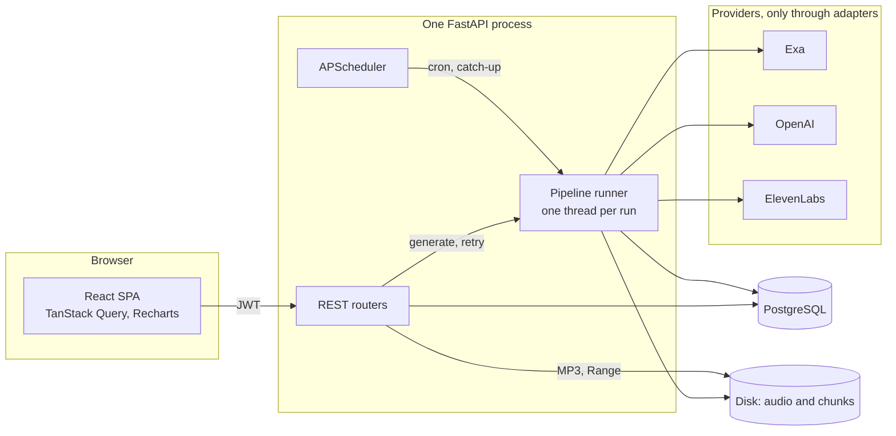
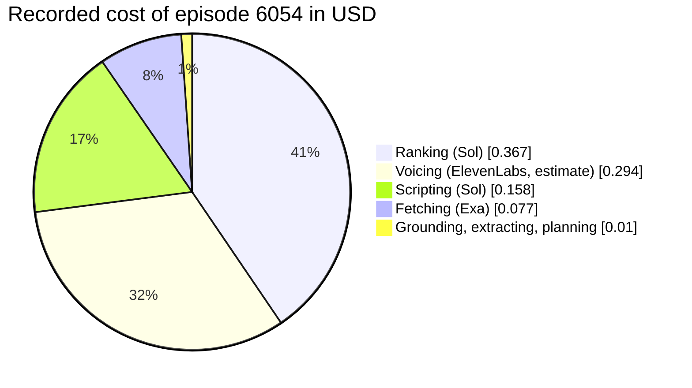
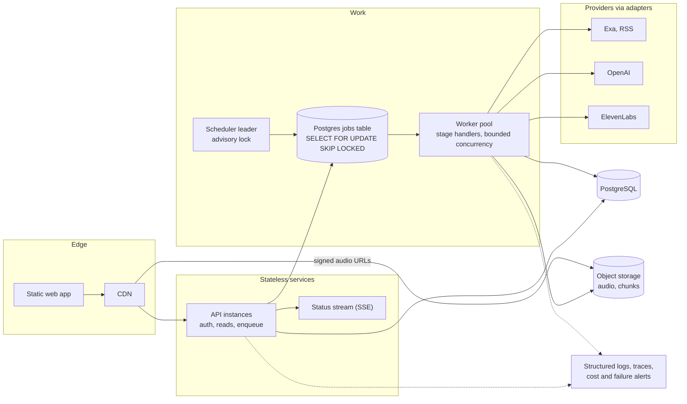

# Personal Podcast Generator — decisions, trade-offs and next steps

> **DRAFT FOR THE AUTHOR — delete this box before submitting.**
> Written from the repository as it stands on 2026-09-29: `docs/DECISIONS.md` (D-01 to D-72), `docs/ARCHITECTURE.md` v1.0, the code, `sample.meta.json`, `sample.transcript.md` and `eval/results/`. It is in the first person so you can own it, but I (Claude) inferred some of the reasoning; every place where the log does not say why is marked **[CONFIRM]**.
> **How to iterate on it.** Trade-offs are `T-nn`, weaknesses `W-nn`, next steps `N-nn`. Tell me which IDs to keep, cut, merge, expand or reorder. Sections 4, 8 and 9 are deliberately long; expect to cut.
> **Sources.** `D-nn` is an entry in `docs/DECISIONS.md`. `meta` is `sample.meta.json`. Numbers labelled *arithmetic* are computed by me from those sources. Numbers labelled *hypothesis* are proposals nobody has measured.
> **Open questions for you** are at the very end of this file, under "Questions for the author".

---

## 0. Summary

**What it is.** A user describes their interests once. On a schedule, or on demand with an optional "this week I want to know about X", the backend finds recent news with Exa, decides which stories fit the listener, writes a two-host script in which every factual claim is checked against the articles it came from, voices it with ElevenLabs, and publishes an MP3. An admin dashboard shows product, operations and quality metrics.

**The sample.** `sample.mp3` is episode 6054, *"ElevenLabs v4 and the Live-Call Test"*: 4 stories from 4 sources, 7 min 36 s, 1,072 words, **0 unsupported-claim flags**, $0.91 recorded cost (meta). Transcript and sources: `sample.transcript.md`.

**What I think is good.**
1. **Grounding is structural, not a request to the model.** Each story section is written against only its own sources, checked claim by claim, patched once, and never rewritten afterwards (T-12, T-13).
2. **Every paid call is recorded and every stage is resumable.** A failure never makes me pay for TTS twice, and cost is visible per stage, per provider and per episode (T-04, T-25).
3. **Decisions were measured where measuring was cheap.** The classifier choice came from a 60-row hand-labelled eval with pass/fail rules written before the numbers existed; a cheaper model was rejected because it failed them (T-09).
4. **The design fits in one head.** One process, four adapter interfaces, one status column, one table for operational metrics.

**What I think is weak (details in §8).**
1. The classifier that decides which stories air is the biggest cost line: **40% of the sample episode** (T-09).
2. "Quality" is measured with proxies on a handful of episodes and one annotator. There is no listener study and no automatic audio QA (W-01, W-02).
3. It is a single-instance system with open sign-up and no rate limiting (W-04, W-05).
4. Operationally it is a demo: one `docker compose up` runs it, but there is no CI, no hosting and no observability beyond logs (N-02, N-08, N-10).

**What I would do next, in order.** CI (N-02) · put the job runner behind a queue (N-05) · cut ranking cost with a cheap pre-filter and measure it (N-11) · add episode memory (N-13) · run a real listening test (N-19).

---

## 1. What was built

| Piece | State | Where |
|---|---|---|
| Pipeline: plan → fetch → rank → extract → script → voice → assemble | Built, real providers | `backend/app/pipeline/` |
| REST API (auth, sign-up, preferences, episodes, events, admin) | Built | `backend/app/api/` |
| Scheduler with restart recovery and catch-up | Built | `backend/app/scheduler.py`, `pipeline/episodes.py` |
| React app: login, sign-up, interests, episodes and player, transcript, admin dashboard | Built | `frontend/src/` |
| Classifier eval (Luna vs Sol vs Jev, 60 labelled rows) and a stale-article eval | Built, results committed | `eval/`, D-44, D-45, D-61 |
| Admin dashboard with real and seeded data, honestly labelled | Built | D-51 to D-55 |
| Fake adapters for every provider, 257 tests | Built, all passing on 2026-09-29 | `backend/tests/`, D-73 |
| One-command Docker stack, plus a no-keys demo on fake providers | Built and run end to end | `docker-compose.yml`, `docker-compose.fake.yml`, T-28, D-73 |
| RSS sources, episode memory, hosted deployment, SSE, CI | **Not built** | §9 |

**Screenshots** (`docs/screenshots/`): `login.png`, `signup.png`, `prodcast-settings.png`, `profile-generation.png`, `profile-detail.png`, `episode.png`, `episode-detail.png`. Admin dashboard, captured from the Docker stack on fake providers (D-73): `admin-overview.png`, `admin-product.png`, `admin-operations.png`, `admin-quality.png`, and `admin-operations-real-only.png` (synthetic data off: only what one fake episode recorded).

## 2. Architecture at a glance

More detail, and every other diagram (frontend, API, backend, database, scripting, restarts), is in `docs/ARCHITECTURE.md`.

## 3. How an episode is made

1. **Plan.** Luna turns the listener's profile, the focus request and the last two episodes' headlines into topic-tagged search queries. They are stored on the episode, so every later choice is traceable.
2. **Fetch.** One Exa search per query with the recommended request shape and a date window. Results go into a shared `articles` table, deduplicated by URL.
3. **Rank.** A classifier scores every (article, topic) pair on relevance, newsworthiness, "already covered" and "stale". A minutes budget by topic depth picks the stories: focus story first, then one per topic, then by score.
4. **Extract.** Full text only for the selected stories, and only if not already cached.
5. **Script.** An outline gives each story a take. Each section is written against its own sources, fact-checked, and patched once. A separate call writes the intro and outro.
6. **Voice.** The script is cut into chunks of at most 1,800 characters at story boundaries and sent to ElevenLabs Text to Dialogue, up to four at a time.
7. **Assemble.** Chunks are joined with pauses, loudness-normalised to −16 LUFS, and encoded to a 128 kbps MP3.
8. **Publish.** The episode becomes `ready`; the player, transcript and sources appear in the app; play and rating events flow back into the dashboard.

**What one real run costs and takes** (episode 6054, 10-minute target; meta):

| Stage | Provider, model | Cost | Recorded time |
|---|---|---|---|
| Planning | OpenAI `gpt-6-luna` | $0.0003 | 4.9 s |
| Fetching | Exa | $0.0770 | 12.1 s |
| Ranking | OpenAI `gpt-6-sol` | $0.3669 | 4.7 s |
| Extracting | Exa | $0.0010 | 0.8 s |
| Scripting | OpenAI `gpt-6-sol` | $0.1577 | 143.4 s |
| Grounding (inside scripting) | OpenAI `gpt-6-luna` | $0.0084 | 82.6 s |
| Voicing | ElevenLabs `eleven_v3` | $0.2941 **(estimate)** | 110.7 s |
| Assembling | local ffmpeg | $0 | 23.2 s |
| **Total** | | **$0.9055** | ≈ 6.4 min *(arithmetic: the seven stage times plus grounding, which runs inside scripting but is recorded separately)* |

---

## 4. Architectural decisions and trade-offs

Each item: **Decision**, **Why**, **Alternatives I rejected**, **What it costs**, **Evidence**, and **when I would change it**. Cut whatever does not matter to you.

### A. System shape

#### T-01 One process, daemon threads, in-process scheduler
- **Decision.** API, APScheduler and the pipeline run in one FastAPI process. `POST /episodes/generate` starts a plain daemon thread per run; cron jobs run the same code on the scheduler's thread (D-02, D-34).
- **Why.** The assignment is a few users and 10–15 hours of build time. A queue and workers would add Redis, a worker deployment and a second failure domain, and would not make the product better for a reviewer.
- **Rejected.** Celery/RQ + Redis (infrastructure for no benefit at this volume). Exa Monitors (server-side scheduled search, but needs a public webhook). FastAPI `BackgroundTasks` (ties the run to a request in a way that reads misleadingly for a job people poll for minutes).
- **Costs.** No retry queue, no dead-letter queue, no view of "how many runs are in flight", and an unbounded thread count (D-34). **Two API instances would run every scheduled job twice** (ARCHITECTURE §8). A restart kills in-flight runs, which I mitigate rather than prevent (T-04).
- **Change when.** More than one API instance, or more than a handful of concurrent users. See N-05.

#### T-02 PostgreSQL with JSONB; audio on disk; a shared article cache
- **Decision.** Relational tables for users, episodes and metrics; JSONB for things that are documents (interest profile, planned queries, script, grounding flags, prompt versions). Audio on the local disk. `articles` is shared across users and episodes and caches both search results and extracted text (D-24).
- **Why.** Matches the team's stack. The script, its outline and its trace live on the episode row, so an episode can be re-read, re-voiced or re-scripted without any other state. Files serve `Range` requests for seeking (D-36).
- **Rejected.** `bytea` audio in Postgres (bloat). pgvector for article selection (I wanted direct, explainable scores; see T-09).
- **Costs.** Local disk is not portable: hosting needs object storage (N-08). Article text is never refreshed, so a long-lived deployment would serve stale copies (D-24). JSONB columns are not type-checked by the database; Pydantic validates on the way in and out.

#### T-03 Four adapter interfaces, every call returns `(result, Usage)`, fakes for everything
- **Decision.** `SearchSource`, `LLM`, `Classifier`, `TTS` as `typing.Protocol`s. Pipeline code never imports an SDK. Each call returns its result and a `Usage` (units, cost, latency, provider, model). Every adapter has a fake (D-15).
- **Why.** It makes three things cheap: tests that never touch a real API, swapping a provider through `.env` (the classifier switched providers twice), and one place that prices every call (`pricing.py`).
- **Rejected.** Calling SDKs from the stages (fast to write, untestable without mocks, and costs would be scattered). A generic plugin framework (CLAUDE.md: no abstractions beyond the four).
- **Costs.** The protocol is the lowest common denominator: for example, ElevenLabs request stitching is not exposed. `Classifier.score` grew two arguments over time (`topic`, `window_start`), and every implementation had to follow (D-23, D-61).

#### T-04 Every stage commits; `status` means "the next stage to attempt"
- **Decision.** The runner commits after each successful stage, together with its `pipeline_steps` row. `episodes.status` is always the next stage to run (or `ready` or `failed`). Resuming needs no extra bookkeeping (D-37).
- **Why.** In the first version the whole run was one transaction, so a crash lost every stage's output *and* the record of money already spent, and a poller saw `pending` until the very end. A failure at voicing must never make me pay for scripting again, or for TTS twice.
- **Restarts (D-38).** On boot every in-progress episode is an orphan: it is marked `failed` with `error = "interrupted"` and a `system` step row, then auto-resumed **once** (never a crash loop). A cron fire missed while down produces **one** catch-up run, however long the outage, because the news window starts at the last ready episode. `misfire_grace_time` is one hour. Runs paused with the CLI's `--stop-after` are never auto-resumed, so starting the API cannot silently pay for TTS.
- **Rejected.** APScheduler's persistent job store (a second, pickled copy of each schedule that can drift from `preferences.schedule_cron`). Draining runs on shutdown (the runner's open session would overwrite what shutdown wrote). A watchdog for hung threads (provider calls have their own timeouts).
- **Costs.** A commit that fails *after* a paid stage loses that stage's usage row (seen once: about $0.58 of TTS unrecorded, D-56). Recovery cannot tell a live CLI run from an orphan, and once resumed an episode a running CLI was scripting (D-59 point 7).

#### T-05 "One episode in progress per user" is a database rule
- **Decision.** A partial unique index `ON episodes(user_id) WHERE status NOT IN ('ready','failed')`. Retry is one conditional `UPDATE ... WHERE status = 'failed'` committed before the thread starts (D-37).
- **Why.** The original check-then-insert let two concurrent callers both pass (a double-click, or a cron fire racing a click). One mechanism, enforced by Postgres, is easier to explain than a Python pre-check plus a lock.
- **Rejected.** `SELECT ... FOR UPDATE` (works, but the conditional `UPDATE` is one statement). Keeping both a pre-check and the index (two mechanisms for one rule).
- **Costs.** Postgres-specific. Every caller must handle `EpisodeConflict` (the API returns 409, the scheduler logs and skips, the CLI prints).

### B. Finding and choosing the news

#### T-06 Exa as the only source
- **Decision.** Exa `/search` with LLM-planned queries; nothing else (D-06).
- **Why.** Users can type any interest, so a fixed feed list cannot cover them. Exa returns full text, and the request shape is documented by Exa's own guidance (D-07): `query`, `type: "auto"`, `contents.highlights`, `startPublishedDate`; no `category`, `numResults`, domain filters or `maxAgeHours`.
- **Rejected.** NewsAPI-style aggregators (dev-only free tier, snippets only, about a day of delay). Reddit (a 2–4 week approval queue). X (pay per read, low signal). RSS (planned as a later step, N-14).
- **Costs.** Coverage is whatever Exa indexed. Two visible symptoms: a months-old Bundesliga article carrying today's `published_date` reached an episode (D-28, D-59), and undated results exist and must be handled (D-57).

#### T-07 Cheap first, expensive later: search highlights → classify → full text for the winners
- **Decision.** Classification runs on title + highlights. Full text (`/contents`) is fetched only for selected stories and only if not cached (D-07, D-24).
- **Why.** In the sample run, search cost $0.077 and extraction $0.001. Fetching text for every candidate would have paid for text the episode never uses.
- **Costs.** The classifier judges on a snippet. That is why hard staleness cases (no date clue in the highlights) are missed (T-11).

#### T-08 LLM-planned queries, stored on the episode, plus a per-episode focus request
- **Decision.** A Luna call plans about two queries per topic and some for the focus request; recency goes in the query text; the plan is saved (D-08).
- **Why.** Users describe interests loosely, and search needs concrete queries. Storing the plan makes any selection explainable after the fact. It costs $0.0003 (meta).
- **Costs.** **There is no eval of the planner.** If a query drifts off-topic, only the classifier stands in the way. I noticed drift while labelling (an optional label column exists for it, D-29) but I have not measured it. See W-03.

#### T-09 The classifier: Sol with no reasoning, chosen by pre-declared rules
- **Decision.** `gpt-6-sol`, reasoning `none`, prompt `classifier.v2` (D-45, re-confirmed by D-61). Luna and Jev are one `.env` change away.
- **What was measured.** 60 hand-labelled (article, topic) rows from a dedicated eval user with 5 deliberately different topics (D-29, D-44). Rules were written before the numbers existed.

| Classifier | Keep-gate ROC-AUC | Selection precision | p50 latency | $ per 100 articles |
|---|---|---|---|---|
| Luna (v1 prompt) | 0.91 | 0.75 | 1.9 s | $0.014 |
| **Sol (v1 prompt)** | 0.99 | 1.00 | 2.5 s | $0.286 |
| Jev v2 | 1.00 | 1.00 | 0.5 s | $0.007 |

  (`eval/results/latest.md`.) Jev passed all four quality conditions, **but 356 of 413 HTTP responses over the day's runs were 429 or 5xx (86%)** on the free evaluation tier, so it failed the availability condition I added after seeing the outage (D-45). On `classifier.v2` with stale detection, Luna at three reasoning levels missed the gates (best keep AUC 0.943 vs Sol 1.000, selection precision 0.75 vs 1.00), and more reasoning did not help (D-61).
- **Why Sol.** Selection precision is the number that decides what airs. Luna's 0.75 means about one in four selected stories is not one the listener wanted. Sol scored 1.00. Sol's agreement with Luna was only 0.33, so they pick very different stories; "agreement" alone would have hidden which one was right, which is why I added selection precision against the labels (D-44).
- **Rejected.** Jev as the default (cheaper and faster, but unavailable: the fallback to Luna would have fired most of the time). Luna as the default (about 20× cheaper, but failed the quality rules). Embedding similarity with pgvector (a threshold to tune; the classifier gives direct, explainable scores).
- **Costs, honestly.**
  - Ranking is **40.5% of the sample episode's cost** ($0.367 of $0.906). It was $0.354 in the earlier sample (D-64). Cost scales with the number of candidates, not with episode length.
  - **n = 60, one annotator, and clustered near-duplicates.** At that size a paired difference needs about 12 points to be distinguishable from noise (D-44). The decision used point estimates with margins fixed in advance, and the bootstrap interval is printed but does not gate.
  - I overrode my own rule once. D-61's rule said "no config passes, keep the old prompt". I shipped `classifier.v2` anyway because it caught 13 of 15 stale rows, accepting 6 false positives of 61 fresh rows (about 3 good stories out of 39 keepable ones lost). **[CONFIRM: this is written from D-61's "the user overrode that"; say it in your own words.]**
- **Change when.** A cheap pre-filter can drop obvious non-matches before Sol sees them (N-11), or a paid Jev tier makes it available.

#### T-10 Selection: a minutes budget, a focus slot, topic coverage
- **Decision.** `select_stories` (pure, unit-tested) drops covered and stale items and anything with score under 0.3, then fills a minutes budget: a deep story costs 3.0 minutes, a headlines story 1.5. Order: the focus story first, then the best story of each topic (strongest topic first), then by score, with a per-topic cap of half the story minutes (at least 3) (D-25, D-61, D-65).
- **Why.** The score-only version let one topic take every slot (the markets user got no rates story, the general user no climate story, D-61). A story count ignored how deep the listener wanted each topic; minutes make the episode's length follow their choice.
- **Costs.** The constants (0.3 gate, 3-day half-life, 0.5 for undated) are judgment calls, not tuned on data. **Same-event collapsing before selection was never built** (D-22): two outlets covering one event can both be selected. The outline may merge them later (D-59) but nothing guarantees it. Only two topic depths exist.

#### T-11 Staleness is handled in three places, because no one place catches everything
- **Decision.** (1) Recency decay in ranking, with undated articles counted as one half-life old (D-57). (2) `is_stale` in the classifier, told today's date and the window. (3) The outline may **drop** a source with reason `stale: <evidence from its text>`.
- **Why.** Exa's date can be a republish date. Article a655's stored date was 2026-09-26, but its byline read "Feb. 28, 2026" (D-62). Recency decay cannot see that; only the text can.
- **Evidence.** On the stale eval set (76 rows, 12 of the 16 new ones synthetic), Sol/none caught 13 of 15 stale rows including both real ones that had reached an episode (D-61). The outline's own check fired on all 3 rescripts: it caught the known Bundesliga article and a second real one (the US Open final) that nothing else had flagged (D-62).
- **Costs.** One clear false positive: the outline dropped the listener's *focus* article because it attributed another lab's date to it (D-62). Hard cases with no clue in the snippet are missed. The stale flag exists only for the OpenAI classifier; **Jev never returns it** (D-61).

### C. Writing the script

#### T-12 Outline → sequential grounded sections → frame
- **Decision.** Scripting stays one stage but has three steps (D-59, D-62, D-65). The **outline** (one Sol call) orders stories and gives each a *take*, stakes, key facts, an optional tension, a bridge and a word ceiling; it may merge duplicates or drop a source. Each **section** is written by a separate call that sees the whole outline, only its own sources, the listener's profile for that topic and the sections already written. The **frame** call writes the cold open, preview and outro, and is never shown the story text.
- **Why.** Version 1 was one call, and reading real output showed its limits: the writer never saw why an article was picked, a "retry" resent the prompt without the failed draft (a blind reroll), and the writer and the fact-checker saw different amounts of source text. Version 1 cost $0.03–0.08 and took 27–74 s; the outline design costs about $0.10–0.22 and 1.5–2.5 minutes (D-59). It is worth it because every fix is now local.
- **Rejected.**
  - *Parallel sections.* Cost is the same (±10%); sequential gave better coherence, fewer repeats and real bridges. The seam exists: `write_section(..., prior_sections, ...)`.
  - *A polish pass over the whole script.* It reverted 3 of 5 sections in one episode and got the model to invent a disclosure line the grounder then flagged. Replaced by the frame, which cannot touch a story's facts (D-62).
  - *A separate "outlining" pipeline stage.* Needs a migration and a runner change for no user-visible benefit.
- **Costs.**
  - Latency: 143 s of writing plus 83 s of grounding in the sample.
  - More calls, more failure surface. `script.py` is 1,341 lines, the largest module in the repo; if I had more time I would split it (N-23).
  - **The episode comes in shorter than asked.** The sample is 21% under its word budget and 7:36 against a 10:00 target; earlier versions ran 7–15% over (D-59). See T-15.

#### T-13 Grounding: checked per section, against that section's own sources
- **Decision.** Each section is checked by Luna (reasoning low) against its own sources plus the previous story shown as read-only context for its bridge. The grounder writes its **evidence before its verdict** (`supported`, `take` or `unsupported`) and only unsupported claims are flagged. Flagged sections get **one** patch, which is **always kept**; only the turns the patch changed are re-checked. Audio tags are also checked, and fixed by string replacement so the words never change (D-62, D-65, D-68).
- **The policy.** One identical block in the writer, patch and grounding prompts, enforced by a unit test: every number, name, date, quote and event must come from the section's sources; hosts may interpret, judge and compare without hedging as long as they add no new specific.
- **Why this shape.**
  - Checking the whole script against all sources let a claim be "supported" by the wrong article.
  - "Keep whichever version has fewer flags" kept the unpatched draft on a tie, silently preserving the problem the patch was sent to fix (D-62).
  - Asking the model to justify before it judges was the follow-up D-61 proposed, because more reasoning effort did not stop the flip-flopping. It also lets a host state a take without every take being flagged as a fact (D-65).
- **Evidence.** Sample (episode 6054): 0 flags initial, 0 final (meta). Earlier: 12 → 1 (episode 2875, D-64); 17 → 1 on the first take-driven script (D-65).
- **Limits (please read).**
  - **An LLM is judging an LLM.** It checks the script against the *provided articles*, not against reality; if the article is wrong, the episode repeats it.
  - **It is noisy.** Re-checking the same 12 sections three times, 8 of 84 turns flipped verdict between runs; a higher reasoning level cut that by only 12% at 1.26× cost, so I kept `low` (D-61).
  - **It missed a fabricated attribution.** A section said "According to Reuters" for an article that never mentions Reuters (D-62, consequence 1). I found it by querying the article, not through the pipeline, and I have no recorded fix. I also have **no measured precision or recall for the grounder itself**, only spot checks. See W-02.
- **Cost.** $0.008 per episode, but 83 s of latency.

#### T-14 Editorial voice: the outline states a take, not a question
- **Decision.** The outline's `angle` is a declarative, arguable claim; both hosts report and interpret; a section may hold at most one real follow-up question; `tension` is set only when a source directly tests the take (D-65, D-68).
- **Why.** The first real script read like an LLM simulating a conversation: nearly every section ran "fact → rhetorical question → 'No.' → answer". Reading the prompts showed the pattern was *requested*: the outline asked to "open a question the section then answers", and the writer had to make host B ask the sceptical question (D-65).
- **Evidence (counts, not listening tests).** Questions in story sections 7 → 0; audio tags 0 → 4, all judged fitting by the grounder; turns of 40+ words 16 → 7; initial fact flags 7 (v3) → 1 (v4, v5) → 0 (v6, v7) (D-66 to D-70).
- **Costs.** These are proxies on one to three episodes per version; I wrote "one sample is not a distribution" in the log (D-66). Some fixes traded one tic for another (bare-agreement openers were removed, then "those numbers we opened with" appeared, D-70). The listener's subjective experience has not been measured (W-01).

#### T-15 A length model that is an estimate: 135 words per minute, ceilings, not targets
- **Decision.** 135 wpm; each section has a ceiling and only exceeding it by more than 10% is an error; a short section is accepted; the total is only warned about outside ±20% (D-59, D-62).
- **Why.** 150 wpm overshot by 19% on the first real episode (973 words → 428 s, D-28). Scaling a section's word ask *up* to hit a total padded a thin story to 1.58× (D-62), so growth is capped at 1.3× and shrinking is unlimited. Failing a whole paid stage over a length miss is worse for the listener than a slightly long or short episode.
- **Costs.** 135 comes from one measurement. The sample ran 21% under budget; that is outside the ±20% warning band (the pipeline logs a warning and continues). The data to fit wpm properly (duration and word count of every finished episode) is already in the database (N-03).

#### T-16 Runtime prompts are versioned files, and the highest version wins
- **Decision.** `app/prompts/<name>.vN.md`; the highest version loads automatically; the versions used are saved on the episode (`prompt_versions`). Old versions stay on disk (D-59).
- **Why.** Prompt changes are code changes and must be reviewable, diffable and attributable to a listening note. The dashboard can chart rating by prompt version.
- **Costs.** There is no per-episode pin and no rollback other than deleting a file, so a bad new version goes live for everyone. The classifier's version is **not** stored on the episode (D-61). The outline prompt has 6 versions, the section writer 7 and the frame 5, which is a lot of history to carry.

### D. Voice and audio

#### T-17 Text to Dialogue (`eleven_v3`), chunks of at most 1,800 characters at story boundaries
- **Decision.** Whole sections are packed into chunks of at most 1,800 characters (ElevenLabs recommends at most 2,000). A section that alone exceeds the limit is split only at turn boundaries. Chunks are joined with 600 ms of silence, plus 1.5 s at the end (D-04, D-71).
- **Why.** v3 has no request stitching, so prosody can shift at a chunk boundary; putting boundaries where the story changes makes the shift sound natural.
- **Rejected.** One call for the episode (over the limit). One call per line (loses turn-taking, and v3 cannot stitch). GenFM "Create Podcast" (a black box over the script, the grounding and the personalization).
- **Costs.** Output is nondeterministic; for `sample.mp3` I generated more than one take and picked the best **[CONFIRM]** (ARCHITECTURE §5.6 planned "2–3 takes"; the log records one). There is **no automatic audio QA**: no speech-to-text round trip to catch a mispronounced name or a dropped line, and no check on loudness beyond `loudnorm`. See W-02.

#### T-18 Parallel chunks with a process-wide cap, retries and a spend pre-flight
- **Decision.** Missing chunks are sent through a thread pool of up to 4. A process-wide semaphore in the adapter keeps *all* episodes under the account's concurrent-request limit. 429s, 5xx and connection errors retry up to 3 times with backoff and jitter; 401, 422 and read timeouts fail at once. Before sending, `voice.run` checks that today's spend plus the batch estimate fits under the cap. The first failure stops queued chunks but keeps finished ones and reports their cost (D-56).
- **Why.** Voicing was 54–68% of generation time (median ~133 s of ~220 s). The limit is concurrent *requests*, not requests per minute; this key accepted 4 with no 429.
- **Evidence.** Episode 3: 5 chunks, 4 workers, 47 s wall time against a sequential baseline of ~133 s, a 2.7× speed-up, with per-chunk speed unchanged (D-56).
- **Costs.** I could not read this key's real limit (the `user_read` scope is denied, D-09), so 4 is measured, not documented. The SDK does not retry the streaming call the dialogue endpoint uses, so retry logic lives in my adapter, which is more code to maintain.

#### T-19 MP3 chunks are decoded and encoded once; loudness normalised to −16 LUFS
- **Decision.** Default output `mp3_44100_128`. Chunks are decoded, joined, exported to WAV, then `ffmpeg loudnorm` and `libmp3lame` at 128 kbps (D-26, HANDOFF).
- **Why.** PCM would avoid a second lossy generation but needs a paid ElevenLabs tier. The PCM path is implemented and was verified (D-26: raw PCM must be decoded as 16-bit little-endian mono, which I confirmed empirically).
- **Costs.** Two lossy generations on the default path. `ffmpeg` must be installed locally; it is a prerequisite, not bootstrapped.

#### T-20 Voices: a curated list, chosen per user, resolved once per episode
- **Decision.** Nine curated premade voices (this key cannot list the account's library); the user's choice per host is stored in preferences; `voice.run` resolves them once per episode, before spending anything (D-09, D-58).
- **Costs.** If a user changes a voice between a failed voicing attempt and its retry, chunks already on disk keep the old voice, so one episode can mix two (D-58, open). Voice previews only play if `data/voice_previews/<id>.mp3` exists, and nothing in the repo creates them (W-08).

### E. Product and API

#### T-21 Auth: JWT, sign-up, media tokens; 403 for someone else's episode
- **Decision.** HS256 JWT, 12 hours, no refresh, no revocation (D-33). Self-service sign-up with 8–72 character passwords and a clear 409 for a taken email (D-47). A native `<audio>` cannot send a Bearer header, so the episode detail returns an `audio_url` carrying a **1-hour token scoped to that one file, with no `sub`**, which can never pass `current_user` (D-40). Someone else's episode is a 403, not a 404.
- **Rejected.** The login JWT in the URL (12 hours of full access in server logs). Fetching audio as a blob (loses streaming and seeking). A generic sign-up error (the clear message was requested).
- **Costs.** Logout only forgets the token. The token lives in `localStorage`, readable by any script on the page. **Sign-up is open and unthrottled, and every account can spend real money up to the daily cap** (W-05). An `audio_url` stops working an hour later, so a player left open across a re-buffer can hit a 401 (D-46).

#### T-22 Live status by polling every 3 seconds, not server-sent events
- **Decision.** The episodes list and detail page poll every 3 s while any episode is not `ready` or `failed`, then stop (D-41).
- **Why.** An episode takes minutes, so 3 s is indistinguishable from push; SSE would need a new endpoint and a reconnect story on top of thread-per-run.
- **Costs.** More requests than push. N-07 is the upgrade path.

#### T-23 Listening state and ratings come from the events table
- **Decision.** "New / In progress m:ss / Played" and the resume point are derived on the server from `play_started`, `play_progress` and `play_completed` events. Ratings are append-only events, latest wins, and value 0 clears (D-40, D-46). The server writes the events a client must not forge (`generate_clicked`, `profile_updated`, `settings_changed`); a client can send only four types, all about its own episode (D-37).
- **Why.** The events already exist for the dashboard; a second source of truth (a `listen_position` column) could drift from them.
- **Costs.** `_playback_state` reads all of a user's play events for the listed episodes; it would need a latest-per-episode query if events grew large.

### F. Measurement and honesty

#### T-24 One table feeds every operational metric, and mock data is flagged
- **Decision.** `pipeline_steps` records provider, model, units, cost, latency and error for every call, so cost per episode, p50/p95 per stage, failure rate per stage and cost per listened minute are all queries. Seeded rows carry `is_synthetic`; the dashboard has a toggle and prints "Includes seeded synthetic data" under a chart while it is on (D-51 to D-53).
- **Why.** A dashboard that silently mixes real and invented data is worse than none. The seed derives stage latencies and costs from the medians of real rows.
- **Costs.** The dashboard is mostly seeded: when I built it there were 11 real episodes and no completed play (D-51). A metric that looks healthy there proves the plumbing, not the product. Two bugs found by using it, not by tests: a percentage that showed 7119% (D-54) and a JSON `null` that crashed one query (D-52).

#### T-25 Cost is exact where the provider tells me, and labelled as an estimate where it does not
- **Decision.** Exa: its own `costDollars`. OpenAI: exact tokens × price. Jev: the gateway's `marketCost`. **ElevenLabs: the character count is exact** (the `character-cost` response header), **but dollars are `characters × ELEVENLABS_USD_PER_1K_CHARS`**, flagged `cost_is_estimate` and labelled as an estimate anywhere it is shown (D-12).
- **Why.** The real plan price is invisible with this key.
- **Costs.** **The recorded sample cost is probably not at the configured rate.** The sample's voicing row says $0.294 for a transcript of about 6,700 characters, which is about $0.044 per 1,000 characters; the default is $0.11, which would give about $0.74 (*arithmetic*). I suspect a local `.env` override **[CONFIRM]**. Section 6 shows both.

#### T-26 Testing: fakes only, and manual real-provider acceptance runs recorded in the log
- **Decision.** Tests never hit real APIs; 257 tests, all passing on 2026-09-29 (D-73). A browser run of the Docker stack on fake providers (sign in, build a profile, generate, play, rate, open the dashboard) is scripted but not in the repo. Real runs happen through the CLI, and their cost and result are written into `DECISIONS.md` (for example D-27, D-64). Fixture dates are rebased to "now" so the recency gate does not age out (D-49).
- **Costs.** No CI (N-02). **No frontend tests at all**, and `types.ts` is hand-written from the Pydantic schemas with nothing to catch drift (D-41). No browser test drove the app end to end (D-53 records that no browser was available). I did not re-run the test suite for this documentation pass.

#### T-27 Process: phases, a decision log, one bootstrap script
- **Decision.** The build was split into phases with acceptance checks (`docs/phases/`), every non-trivial decision was logged (72 entries), one virtualenv only, and `scripts/setup.py` as the single bootstrap (D-10, D-11).
- **Why.** The judged items are the sample, this document, and whether I understand every decision; the log is the raw material for this file.
- **Costs.** The log is long (about 265 KB) and some entries are dense. Earlier merges damaged it twice (D-62's body replaced by D-58's, a chore numbered D-66 twice); I repaired both in D-72 and added an index.

#### T-28 Packaging: one `docker compose up`, and a no-keys demo on fake adapters
- **Decision.** Three services: `db` (Postgres 16), `api` (Python 3.12 + `uv` + `ffmpeg`; its entrypoint runs `alembic upgrade head`, `seed-users` and `seed-metrics`, then uvicorn) and `web` (a Vite build served by nginx with an SPA fallback). `docker-compose.fake.yml` switches all four adapters to fakes, so a reviewer with no API keys can use every page, generate episodes and see the dashboard fill in. `python scripts/setup.py` still starts only `db`, for development with `uv` and `npm` (D-73).
- **Why.** A reviewer will try to run it. The fake adapters already existed for tests; reusing them turned the no-keys case into a working demo instead of an error screen.
- **Rejected.** A `Makefile` (not on a default Windows machine, and the author works on Windows). Migrations in a separate one-shot service (more moving parts for a single-user demo). Putting the API behind nginx on one origin (changes CORS and the media-token URLs for no demo benefit).
- **Costs.** `VITE_API_URL` is baked in at build time, so the web image must be rebuilt for another API address. Seeding on every start replaces the synthetic dashboard data each time (deterministic per day). Fake episodes are silent, with a canned script, so they show the mechanics, not the quality: `sample.mp3` is the quality evidence.
- **Evidence.** Built and run end to end on 2026-09-29 from an empty database: sign-in, profile, a generated episode (6.4 s on fakes), playback, rating, and the dashboard (screenshots in `docs/screenshots/admin-*.png`). A restart with an episode in flight recovered it and auto-resumed it to `ready`. Running it also found two bugs, both fixed: the fake adapters' fixtures were excluded from the image, and an adapter that failed to construct left its episode stuck forever (§5).

---

## 5. Quality and reliability

**What stands between a model mistake and the listener.**

| Layer | What it does | Evidence |
|---|---|---|
| Structured output | Every LLM call returns a Pydantic model; invalid output is an error | `adapters/llm` |
| Story selection | Relevance × newsworthiness × recency; stale, covered and low-score dropped | T-10, T-11 |
| Outline validation | Every selected article used exactly once or dropped with a reason | D-59 |
| Section validation | 3+ turns, both hosts, turn length, banned phrases, word ceiling | D-59, D-62 |
| Grounding | Per-section claim check, one patch, residual flags recorded | T-13 |
| Tag grounding | Audio tags checked; fixes never change words | D-68 |
| Frame validation | Intro and outro present; request-narrating phrases rejected in code | D-69 |
| Guardrails | Max TTS characters, daily spend cap, batch pre-flight | D-56 |

**What happens when something fails.**

| Failure | Detected by | Result |
|---|---|---|
| TTS 429 / 5xx / connection error | ElevenLabs adapter | Retry ×3 with backoff; a hard failure stops queued chunks and keeps finished ones and their cost |
| Jev 429 / 503 | `JevClassifier` | 5xx retried; a 429 pauses Jev for 5 minutes; each article falls back to the OpenAI classifier; `fallback_count` recorded |
| Exa `/contents` fails for a URL | `statuses` field | Article stays on its highlights |
| Script fails validation | `validate_*` | One repair call; then the stage fails with the spent usage still counted |
| Grounder flags a claim | Grounding check | One patch, kept; remaining flags stored in `grounding_flags_final` |
| Process restarts mid-run | Boot recovery | Marked `interrupted`, resumed once at the same stage |
| Missed cron fire | `catch_up_due` | One catch-up run |
| Daily cap reached | Runner | Stage fails with "daily spend cap exceeded" |
| Double click / concurrent generate | Partial unique index | 409 |
| Provider call hangs | OpenAI client: 90 s timeout, 1 retry | Stage fails; Retry resumes from it |
| An adapter can't be built (e.g. missing API key) | Runner, before the first stage | Episode fails at the stage it would have started, retryable. It used to stay `pending` forever and block the user (fixed in D-73) |
| `ffmpeg` missing | Assemble stage | Fails with a clear message; voicing is already paid, so Retry resumes at assembling only |

**Classifier eval, in one place.**

| Question | Answer | Source |
|---|---|---|
| Does a 20× cheaper model work? | No. Luna's selection precision was 0.75 vs Sol's 1.00 | D-44, D-61 |
| Does extra reasoning help Luna? | No; medium had the most false stale flags | D-61 |
| Does the cheap, fast option work? | Quality yes; availability no (86% of responses 429/5xx) | D-45 |
| Can stale articles be detected? | 13 of 15 caught; 6 of 61 fresh rows wrongly flagged | D-61 |
| Does more reasoning quiet the fact-checker? | Cut flips 12% at 1.26× cost; not adopted | D-61 |

---

## 6. Cost and latency

**Where the money goes** (episode 6054, recorded; ElevenLabs is an estimate):

| Measure | Recorded | At the default ElevenLabs rate *(arithmetic)* |
|---|---|---|
| Cost per episode (7.6 min of audio) | $0.91 | about $1.35 |
| Cost per audio minute | about $0.12 | about $0.18 |
| Share that is LLM | 59% | 40% |
| A daily episode for one user for 30 days | about $27 | about $40 |

What the earlier samples showed: episode 2875 (6-minute, first sample) cost $1.15 in total with ranking again the biggest OpenAI line at $0.354 (D-64); a 20-minute episode was estimated at about $1.80 of TTS (D-65).

**What that means.** The default guardrail is $5 a day (`DAILY_SPEND_CAP_USD`), which is 3 to 5 episodes. A personalised daily podcast costs roughly $27–40 per user per month in provider fees before any hosting. That is not a viable price for a consumer product as it stands; the levers, in order of size:

| Lever | Expected effect | Status |
|---|---|---|
| Pre-filter candidates with a cheaper model or rule before Sol (N-11) | Could remove a large part of the 40% | *Hypothesis*, unmeasured |
| Share classification across users for the same (article, topic definition) (N-12) | Grows with the user count | *Hypothesis* |
| Shorter default length, or fewer but deeper stories | Scales TTS almost linearly | Arithmetic only |
| A cheaper TTS plan or model | Real plan price is not visible to me | Unknown |
| Lower `max_words` ceilings | Fewer characters per story | Untested |

**Latency.** About 6.4 minutes end to end for the sample (§3): scripting plus grounding is the largest share (226 s of about 382 s), then voicing (111 s) and assembly (23 s, dominated by `loudnorm` and the MP3 encode). Voicing used to be 54–68% of the time before it ran in parallel (D-56). Ranking is fast because it runs 8 calls at once; it is only 4.7 s.

---

## 7. Metrics: what success means

**Success definition (D-53).** *Activation* is a new user's first episode listened to at least 50%; *retention* is any play in week 2 after sign-up. Both are listen-based: a click or a play start shows curiosity, not value. The product's value is delivered entirely in listening.

**On the dashboard today.** Product: DAU/WAU, episodes per day (manual vs scheduled), listen-through rate, average % listened, retention by weekly cohort, top topics, a rating breakdown that sums to 100% of listened sessions, focus-request usage. Operations: p50/p95 per stage, failure rate per stage, cost per episode by provider, cost per listened minute. Quality: the classifier table from `eval/results`, grounding flags initial vs final, rating by script prompt version.

**What is synthetic.** About 150 seeded users over 60 days, with play and rating events shaped like the real ones, marked `is_synthetic` and toggled off with one switch. Real activity is tiny. **Activation as a per-cohort rate is not computed** (D-53 says so); average % listened and listen-through are session-level proxies.

---

## 8. Known weaknesses

| ID | Weakness | Why it matters | Evidence |
|---|---|---|---|
| W-01 | **No listener study.** Quality is judged by reading transcripts, counting tics and my own listening; each prompt version was checked on one to three episodes | The main deliverable is how it *sounds* | D-66, D-70 |
| W-02 | **No automatic audio QA and no measured grounder accuracy.** Mispronounced names, dropped lines and grounder misses are found by hand | A missed fabrication ("According to Reuters") reached a script | D-62 |
| W-03 | **No eval of the query planner or of the profile extractor** | A bad query is only stopped by the classifier | T-08 |
| W-04 | **Single instance.** Two API processes would double-run every job; threads are unbounded; recovery may resume a run a live CLI is working on | Cannot scale out or run behind a load balancer | D-34, D-59 |
| W-05 | **Open sign-up with no rate limit, email check or per-user cap; the token is in `localStorage`; no refresh or revocation** | Anyone reaching the API can spend the daily cap | D-33, D-47 |
| W-06 | **Ranking cost is 40% of an episode**, and classification is never shared between users | Unit economics (§6) | T-09 |
| W-07 | **The eval set is small:** 60 rows, one annotator, near-duplicate clusters; the stale set is 12 of 16 new rows synthetic | The decisions are sound but the confidence intervals are wide | D-44, D-61 |
| W-08 | **Packaging gaps left:** voice preview files are never generated (the ▶ buttons have nothing to play); the web image bakes the API address in at build time; the API container runs migrations and seeds on every start, which suits a demo, not a shared deployment | Small, but visible to a reviewer | D-73 |
| W-09 | **Episodes miss their length target** (sample −21% words, 7:36 vs 10:00) and 135 wpm comes from one measurement | Users choose a length | T-15 |
| W-10 | **Same-event duplicates** can both be selected; no deterministic collapse | Audible repetition | D-22 |
| W-11 | **Article text and Exa dates are trusted**; text is never refreshed; a republish date can hide an old story | Stale news | D-24, D-62 |
| W-12 | **Resuming voicing can mix two voices** if the user changes one between attempts | Rare, but audible | D-58 |
| W-13 | **The classifier prompt version is not stored on the episode**; Jev never returns `is_stale` | Metrics by prompt version are incomplete | D-61 |
| W-14 | **Frontend has no tests and hand-written API types**; no end-to-end browser test | Silent drift and regressions | D-41 |
| W-15 | **`script.py` is 1,341 lines** and the prompt files carry a lot of version history | Maintainability | T-12, T-16 |
| W-16 | **Some tests depended on real time** (fixed by rebasing fixtures); one test failed on `main` at the last recorded run; a cross-process flake was seen once and not fixed | Trust in the suite | D-49, D-71 |
| W-17 | **Disclosure removal is a product decision:** episodes no longer say they are AI-generated | Worth a line in a real product | D-63 |

---

## 9. Next steps

Effort labels (S ≈ hours, M ≈ days, L ≈ weeks) are my estimates. "Depends" names what has to come first.

### The proposed shape after the next steps

### Now: finish what a reviewer will touch

| ID | Step | Why | Effort | Depends |
|---|---|---|---|---|
| N-01 | ~~Dockerfiles for `api` and `web`, fix `docker-compose.yml`, a one-command demo, a dashboard screenshot~~ **Done (D-73).** Left: generate the voice-preview files; move migrations and seeding to a one-shot job before a shared deployment | W-08 | S | — |
| N-02 | **CI on GitHub Actions:** ruff, pytest with fakes, `tsc` and lint for the frontend, and a nightly classifier eval on the fixture set | Nothing runs the 257 tests except me (T-26). Also add frontend tests for the player and settings flows | S–M | — |
| N-03 | **Fit words-per-minute and the length model from data:** regress duration on words for every finished episode; store the classifier prompt version on the episode; log word-budget misses per episode | The sample missed by 21% (T-15, W-09, W-13) | S | — |
| N-04 | **Fix the small correctness gaps:** the attribution rule for outlet names (the "According to Reuters" case), and record voices per chunk so a resume cannot mix them | Both are audible defects (D-62, D-58) | S–M | — |

### Next: reliability and scale

| ID | Step | Why | Effort | Depends |
|---|---|---|---|---|
| N-05 | **Move runs behind a queue.** Start with a Postgres jobs table (`SELECT ... FOR UPDATE SKIP LOCKED`), a worker process with a bounded pool, and the same stage functions. Keep the per-stage commits and the partial unique index | Removes the single-instance limit, bounds threads, gives retry and a dead-letter view (T-01, W-04). A managed queue is the alternative if the team already runs one | M | — |
| N-06 | **A scheduler leader** via a DB advisory lock (the cheaper stop-gap if N-05 waits) | Two instances must not both fire a cron job (ARCHITECTURE §8) | S | — |
| N-07 | **SSE for episode status** (`GET /episodes/{id}/events`), replacing 3-second polling | Push status; the upgrade path is already documented (T-22) | S–M | N-05 helps |
| N-08 | **Hosted deployment:** frontend on static hosting, API and workers as containers, managed Postgres, audio on object storage with signed URLs, HTTPS, secrets in a manager | The only way to try it without installing anything. Budget 2–3 h to stop and document if blocked (phase 09 C) | M | N-01 |
| N-09 | **Auth and abuse hardening:** per-user daily spend caps, sign-up rate limit and email verification, refresh and revocation, tokens out of `localStorage` (httpOnly cookie), dependency and secret scanning | Open sign-up can spend real money (W-05) | M | — |
| N-10 | **Observability:** structured logs with the episode id on every line, traces around provider calls, alerts on daily cost and on stage failure rate, provider status in the admin page | I found problems by reading logs and traces by hand (D-56, D-59) | M | — |

### Next: quality and cost

| ID | Step | Why | Effort | Depends |
|---|---|---|---|---|
| N-11 | **A cheap pre-filter before Sol.** Options to test: a title-and-highlight relevance check on Luna, a keyword/embedding rule, or dropping candidates the profile's exclude list already rules out. Measure keep-gate AUC and selection precision on the same labelled set before shipping | Ranking is 40% of cost (T-09). *Hypothesis:* a two-stage cascade keeps precision at 1.00 for a fraction of the cost. Only the eval can say | M | more labels (N-20) |
| N-12 | **Share classification across users:** cache scores by (article, topic-definition hash) | Same articles, similar topics across users (T-07). *Hypothesis:* the win grows with the user count | M | N-05 |
| N-13 | **Episode memory:** save a three-sentence "what we said" per story; the planner avoids repeats and the script can say "last week we covered X; here is what changed" | The most listener-visible personalization left (phase 09 B) | M | — |
| N-14 | **Niche sources:** a curated RSS `SearchSource` with full text via an extractor, merged with Exa results, plus per-niche pronunciation lists | Exa is thin on niche topics; wrong pronunciations are audible (phase 09 A) | M–L | — |
| N-15 | **Same-event collapse before selection**, as a title/entity and date heuristic within a topic, keeping the best and citing the rest as extra sources | Removes audible repetition (D-22) | S–M | — |
| N-16 | **Per-topic "features count as news" flag.** The eval showed a hobby topic (home renovation) nets 2 keepable rows of 12 because evergreen features are correctly not news | A real product gap, not a labelling artifact (D-44) | S | — |
| N-17 | **Soften the stale rule** as D-61 proposes: worked examples, reason before verdict, a soft margin instead of a hard cutoff. Return `is_stale` from Jev too, or stop using Jev for anything else | Recovers the 3 of 39 good stories lost to false positives (D-61) | S–M | N-20 |
| N-18 | **Versioned prompts done properly:** pin a version per episode, allow rollback, and store every prompt version used (including the classifier's) | A bad new version goes live to everyone today (T-16) | S | N-03 |

### Later: evaluation you can trust

| ID | Step | Why | Effort | Depends |
|---|---|---|---|---|
| N-19 | **A real listening test.** Play pairs of episodes from different prompt versions to a handful of people; record preference and "would you keep listening"; report it beside the rating breakdown | Quality is currently a proxy (W-01) | M | — |
| N-20 | **Grow and harden the eval sets:** 200+ rows, at least two annotators with an agreement figure, real stale examples instead of synthetic, per-topic breakdown, and an eval for the query planner and the grounder (recall of known-bad claims) | Confidence intervals are wide at n = 60 (W-03, W-07) | M–L | — |
| N-21 | **Automatic audio QA:** transcribe the MP3 with speech-to-text and compare with the script (drops, mispronounced names), plus loudness and silence checks | Catches what only listening catches today (W-02) | M | — |
| N-22 | **Use ratings:** feed liked and disliked episodes back into ranking and prompt choice; compute activation as a real per-cohort rate (D-53 flagged it) | Turns the dashboard from a report into a loop | M | more real users |

### Ideas, lower priority

| ID | Step | Why | Effort | Depends |
|---|---|---|---|---|
| N-23 | **Split `script.py`** into outline, sections, frame and grounding modules | 1,341 lines is the largest file in the repo (W-15) | S–M | — |
| N-24 | **Parallel sections** for lower latency. `write_section(..., prior_sections, ...)` is the seam | Sequential was chosen for coherence (D-59); the price is about 143 s of writing in the sample | S | a coherence check |
| N-25 | **A public RSS feed** so episodes play in any podcast app | A stated non-goal today | M | N-08 |
| N-26 | **More languages, and a full voice library or voice cloning** once a key with the right scope exists | This key cannot list voices (D-09) | M | — |
| N-27 | **Refresh article text** past a staleness age | Content is permanent once fetched (D-24) | S | — |

---

## 10. How AI tools were used

**[CONFIRM — this section is written from the repository's evidence; the author should rewrite it in their own words and correct anything I got wrong.]**

- **Claude Code did the building, phase by phase.** `CLAUDE.md` holds the working rules (secrets, providers and cost, Exa request shape, code style, "only do the phase you are asked to do", restate the plan, finish each phase with tests, lint, acceptance checks and a decision entry). `docs/phases/00` to `09` are the plan for each session. Provider notes live in `.claude/skills/` (Exa's official skill, plus OpenAI, ElevenLabs and podcast-script notes).
- **Parallel sessions and worktrees** were used for independent pieces (phase 04's classifier eval, logging, the Jev work), which caused merge problems that the log records honestly (D-42's "merge" that was a file copy, D-45; the `.env` and worktree gap, D-42).
- **Where the human decided.** Choosing the demo profile and reading and labelling all 60 eval rows by hand, over three review rounds (D-44). Setting the decision rules before the numbers existed (D-29, D-44, D-61). Overriding the rule that would have blocked `classifier.v2` (D-61). Adding the availability condition after seeing Jev's outage (D-45). Asking for sign-up (D-47), the media-token privacy choice (D-40), the rating-metric redesign (D-55), removing the AI-disclosure line (D-63), and the listening notes that drove each scripting revision (D-64 to D-70).
- **Where the AI was wrong, and how it was caught.**
  - It misdiagnosed a 401 from Jev as a worker `.env` problem; the real cause was calling the wrong service (D-42, D-43).
  - It reported a 7119% metric (D-54) and a query that crashed on a JSON `null` (D-52); both were found by using the app against the real database.
  - A shared `monkeypatch.undo()` silently sent one test's audio into the real data folder (D-49).
  - Reading the first real transcript found runtime overshoot, a stale story and a repetitive outro that no test could see (D-28).
  - A merge replaced D-62 with a copy of D-58; I found it while auditing the log for this document (D-72).
- **What I did not delegate.** [CONFIRM: which decisions, and the listening.]

---

## Appendix: where every claim comes from

| Claim | Source |
|---|---|
| Sample episode, stage costs, timings, word counts, prompt versions | `sample.meta.json` (episode 6054) |
| Sample transcript and sources | `sample.transcript.md` |
| Classifier comparison and Jev availability | `eval/results/latest.md`, D-44, D-45 |
| Classifier v2 grid, stale recall, fact-checker noise | `eval/results/classifier_v2_grid.md`, `grounding_noise.md`, D-61 |
| Parallel voicing measurements | D-56 |
| Scripting v1 vs v2 cost and time | D-59, D-62 |
| Decisions, alternatives, consequences | `docs/DECISIONS.md` (index at the top) |
| Design, diagrams, API, data model | `docs/ARCHITECTURE.md` |
| Code facts (module sizes, endpoints, constants) | `backend/app/`, `frontend/src/` at commit `28673cf` |

---

## Questions for the author

These need your answer before I finalise; none blocks the drafts above.

1. **Voice.** Do you want first person ("I") throughout, as drafted, or a neutral tone? Who is the reader: the Prosper AI reviewers only, or also a broader audience?
2. **Length.** Sections 4, 8 and 9 are long on purpose. Which trade-offs (T-nn) do you actually want to defend in the interview? I will cut the rest to one line each.
3. **The ElevenLabs cost.** Was `ELEVENLABS_USD_PER_1K_CHARS` lowered in your local `.env` (the recorded voicing cost implies about $0.044 per 1,000 characters against the default $0.11)? If so, what is the right number to quote?
4. **The sample.** Did you generate more than one take of episode 6054 and pick the best? And is its length (7:36 against a 10-minute target) acceptable to say out loud, or should I reword T-15?
5. **Section 10.** Please tell me which decisions and which listening you did yourself, in your words, and whether you want this section at all.
6. ~~Missing material~~ Answered: Docker packaging and the dashboard screenshots are done (D-73).
7. ~~Claims to check~~ Answered: the suite was re-run on 2026-09-29, 257 passed.
